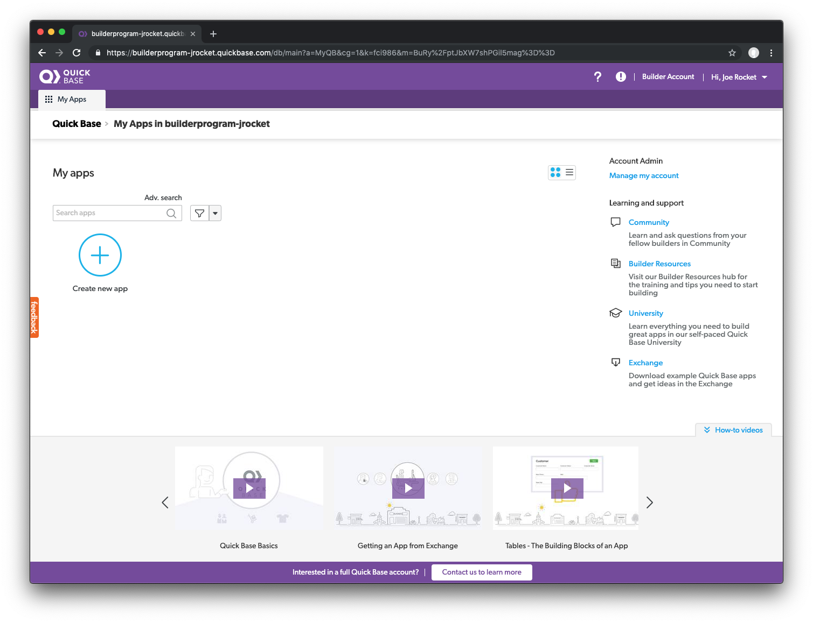

# What is Quick Base

TODO
{: .label .label-red}
... QB elevator pitch, approach, value prop, and philosophy

## Quick Base Builder Account

TODO
{: .label .label-red}
... orientation

## Create Your App

Your friend sent you a link to the Quick Base web site and you found your way to the builder program where you can try building applications using a free builder account and subscription plan. After signing up and verifying your email address, you log into the Quick Base builder domain that was provided in your welcome email and are greeted with an opportunity to create your first app. 

<blockquote>
<b>Note:</b> If you have not already closed the welcome dialogue, please close it and follow the instructions below to create your app.
</blockquote>

The `My Apps` page in Quick Base is the central repository for all of the apps that you create or have access to. You can always return here by clicking the **My Apps** tab in the navigation bar. 

Let's take the plunge and create our first app:

~~~
    1. From the My Apps page, click the large `Create new app` button  
    2. Select Start from scratch and select Next
    3. Name the app `Order Tracking App`
    4. Give the app a description: `Track Customer Orders`
    5. Select an icon to represent your app
    6. Select a color for the app
    7. Select Create app
~~~

When your screen refreshes, the result should look like this:

[Next](createProducts.html){: .btn .btn-purple }