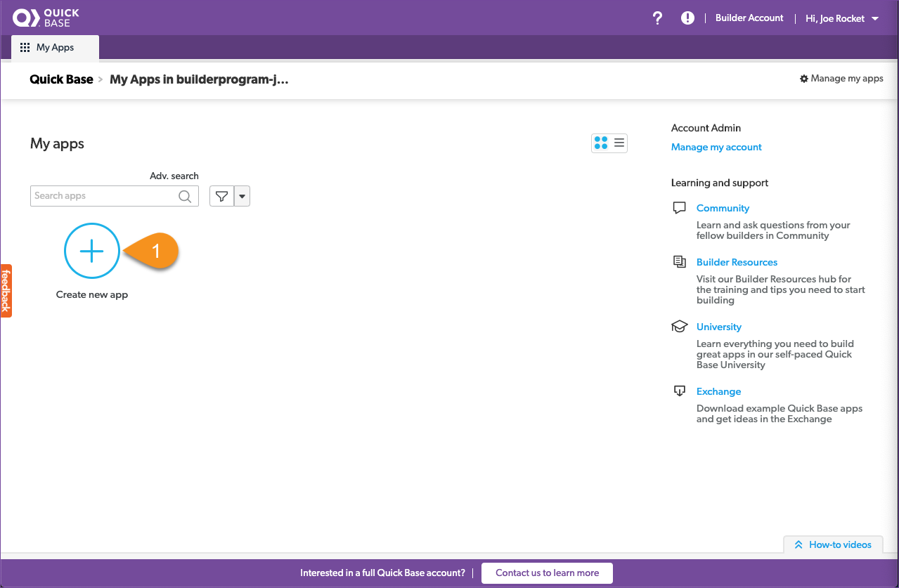
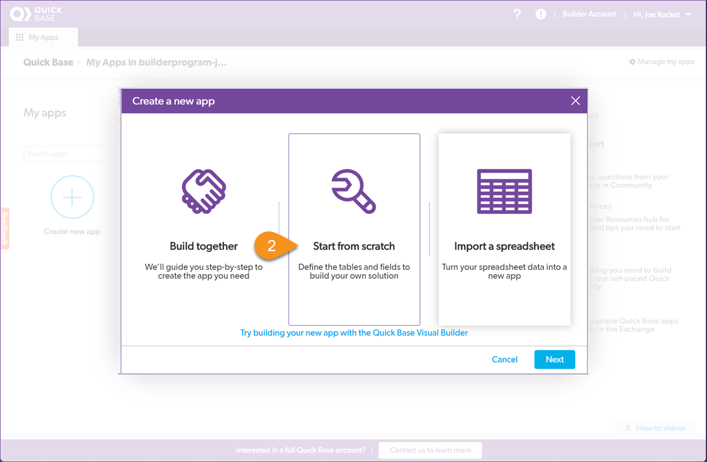
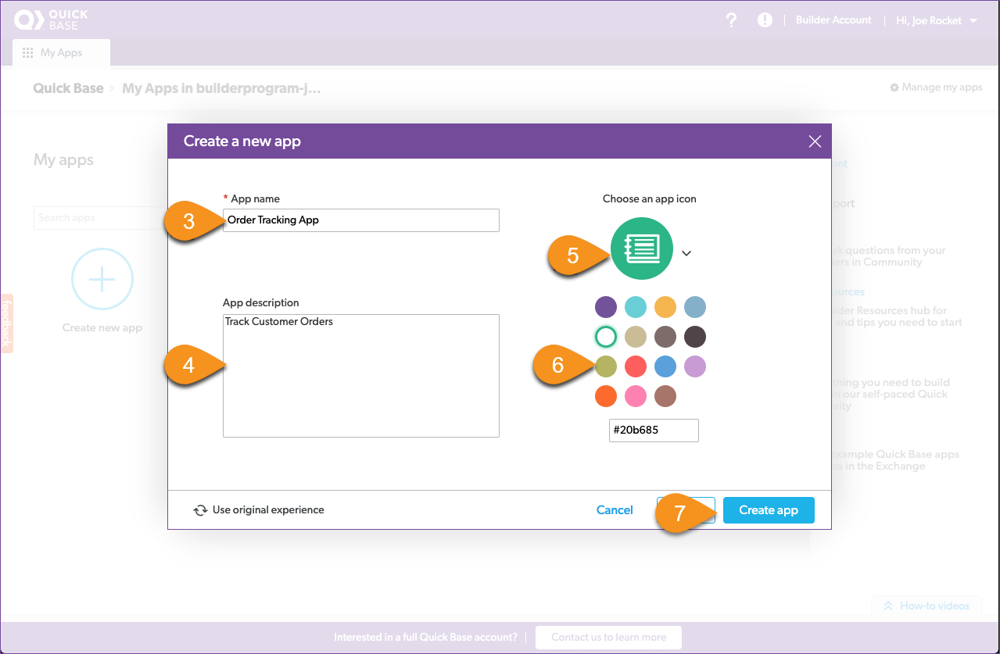

# Your first Quick Base app

Taking a recommendation from a friend, you decide to try building an app using Quick Base. Your friend sent you a link to the Quick Base website, and you found your way to the builder program. After signing up and verifying your email address, you log into your Quick Base builder domain by clicking the link provided in your welcome email. Immediately you're greeted with an opportunity to create your first app. 

> <b>Note:</b> Please log into your Quick Base account and open the application in another window so that you can easily go between this guide and Quick Base.
> If you haven't already done so, please close all dialogues and navigate to the **My Apps** tab. 

The `My Apps` page in Quick Base is the central repository for all the apps that you create or have access to. You can always return here by clicking the **My Apps** tab in the app bar.

Let's take the plunge and create our first app:  
1. From the My Apps page, click the large <b>Create new app</b> button   
2. Click <b>Start from scratch</b> and select <b>Next</b>
3. Name the app: _Order Tracking App_
4. Give the app a description: _Track Customer Orders_ 
5. Select an icon to represent your app 
6. Select a color for the app
7. Click <b>Create app</b>

[Next](createProducts.html){: .btn .btn-purple }
