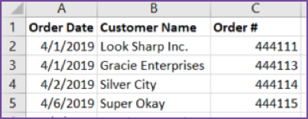
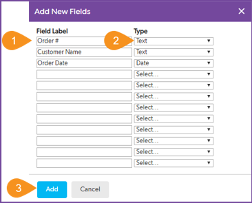
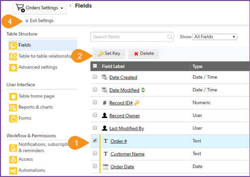

# Storing data in a database

Quick Base allows you to store all of the information in one app arranged in tables. This way, a piece of information in one table is easily used to represent information in another table. We call this related data. When Drew started, all of the order information was stored in one spreadsheet. Over time, the spreadsheet became too large and Drew started to break it into smaller, more focused spreadsheets. Drew aligned the spreadsheets with the tasks in the order process then stored just the data required for that task in a table. If information is needed from an earlier step in the process, Drew finds it and copy's it to the other spreadsheet.

Here is how Drew broke the master spreadsheet into smaller pieces.

| Task | Action | Spreadsheet | Table | 
|:-----|:-------|:------------|:------|
| Add a product | Collect the information needed to sell a product | ProductList.xlsx | Products |
| Create an order | Start a new order and register it in the system | OrderList.xlsx | Orders | 
| Add item to order | List the items delivered in the order | LineItems.xlsx | Order Items |

## Review the orders spreadsheet

Moving through Drew's spreadsheets, the next in line is the `OrderList.xlsx` spreadsheet. Again, we'll start by taking a look at the spreadsheet and understanding what is stored inside. Open the `OrdersList.xlsx` file and take notes about its structure.

Reviewing the spreadsheet, you write down the following notes:

| Column | Meaning | Type |
|:-|:-|:-|
| Order Date | The date that the order was placed | date |
| Customer Name | The customer's name| text |
| Order Number | The order number | text |

SCREENSHOT
{: .label .label-red}

~~~
    1. Select + New Table.  
    2. Select From scratch - Design your own table.
    3. Name the table Orders.
    4. Set A single record is called a to Order.
    5. Select an icon to represent your table. 
    6. Provide a description such as List of customer orders.
    7. Select Create.
~~~

Ok, now add the fields of the table.

~~~
    1. Type field labels Order #, Customer Name, Order Date. 
    2. Set the data types to Text, Text, and Date, respectively, as shown above. 
    3. Select Add. 
~~~

Next change the key field of this table. You did this for the products table, but each table has its own key field. By default, Quick Base automatically creates a Record ID# field for every table and sets it as the key field. But in our Orders List spreadsheet, Order # is unique, so make that the key field:

~~~
    1. Select the checkbox for Order #.
    2. Select Set Key.
    3. Follow the prompts (not shown above) to confirm this change. The key icon should now be next to the Order # field.  
    4. Select Exit Settings.
~~~

## Import the orders spreadsheet

Finally, import the orders from the OrderList.xlsx file you saved earlier. Just like before, the import dialogue box opens and gives you the opportunity to verify that the data will stored correctly. Review the information and import your data.

SCREENSHOT
{: .label .label-red}

~~~
    1. From the Orders table homepage, select More > Import/Export
    2. Select Import into a table from a file
    3. Confirm Select Table is set to Orders and Select Merge Field is set to Order #
    4. Review how each field will be imported to ensure it is correct
    5. Click the Import button
    5. Like before, review the warning and click OK
~~~

A page shows the results: 67 data rows were read, 67 new records were created, 0 existing records were updated, and there were 0 data rows with errors. The import was successful, and your app now contains the data from the OrderList.xlsx file. 

Summary
{: .label .label-red}

[Next](relationships.html){: .btn .btn-purple }