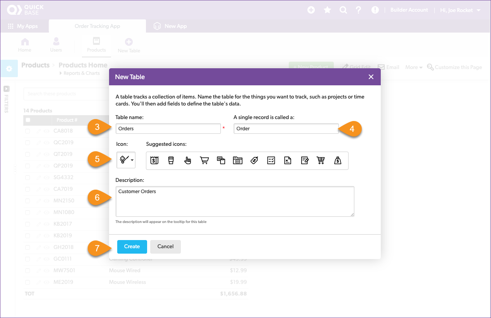
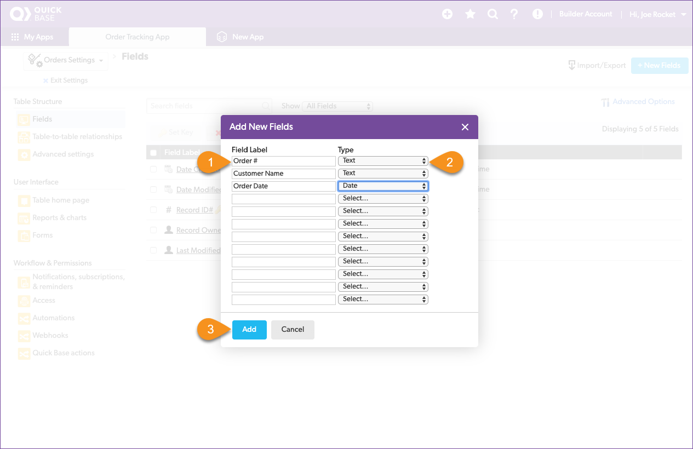
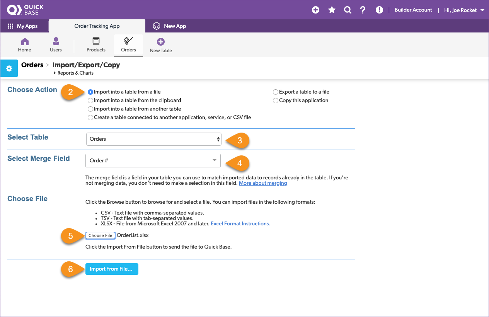
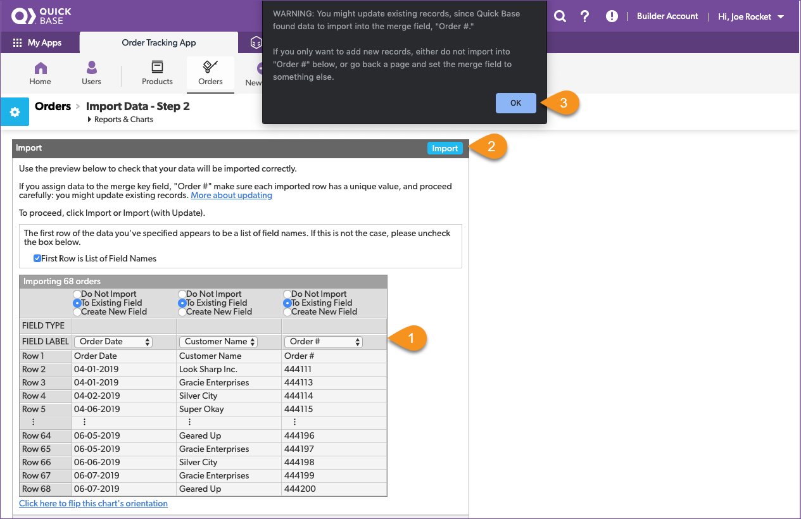

# Storing data in a database

Quick Base allows you to store all the information from multiple spreadsheets in one app arranged in tables. This way, a piece of information from one table is easily used in another table. We call this related data. When Drew started, all of the order information was stored in one giant spreadsheet. Over time, the spreadsheet became too large, so Drew started to break it into smaller, more focused spreadsheets. Drew aligned the spreadsheets with the tasks in the order process, then stored just the data required for that task in a spreadsheet. If information was needed from an earlier step in the process, Drew found it and copied it to the other spreadsheet.

Here is how Drew broke the master spreadsheet into smaller pieces.

| Task | Action | Spreadsheet | Table | 
|:-----|:-------|:------------|:------|
| Add a product | Collect the information needed to sell a product | ProductList.xlsx | Products |
| Create an order | Start a new order and register it in the system | OrderList.xlsx | Orders | 
| Add item to order | List the items delivered in the order | LineItems.xlsx | Order Items |

## Review the orders spreadsheet

Moving through Drew's spreadsheets, the next in line is the `OrderList.xlsx` spreadsheet. Again, we'll start by taking a look at the spreadsheet and understanding what's stored in it. Open the `OrdersList.xlsx` file and take notes about its structure.

Reviewing the spreadsheet, you write down the following notes:

| Column | Meaning | Type |
|:-|:-|:-|
| Order Date | The date that the order was placed | date |
| Customer Name | The customer's name| text |
| Order Number | The order number | text |

Let's take what we learned from the spreadsheet and configure a table to hold the order information. 

1. Click **New Table** from the app nav bar  
2. Click **From scratch - Design your own table**
3. Name the table: _Orders_
4. Set A single record is called an: _Order_
5. Select an icon to represent your table
6. Provide a description
7. Click **Create**

Ok, now add the fields to the table.
1. Create fields to hold the _Order #, Customer Name,_ and  _Order Date_ 
2. Set the data types for each field from our notes above
3. Click the **Add** button

Don't forget about setting the **key field** for the Orders table. 

 1. Select the checkbox for Order #
 2. Click **Set Key**
 3. Click the **Set Key** button in the popup  
 4. Verify that the gold key moved to the Order # field

## Import the orders spreadsheet

Finally, import the orders from the OrderList.xlsx file you downloaded earlier. Just like before, the import dialogue box opens and gives you the opportunity to verify that the data will stored correctly. Review the information and import your data.
Here's how:

1. Click the **Import/Export** button
2. Select **Import into a table from a file**
3. Confirm Select Table is set to _Orders_ 
4. Confirm Select Merge Field is set to _Order #_
5. Click the **Choose file** button and navigate to the _OrderList.xlsx_
6. Click the **Import From File** button

Next we'll review how each field will be imported to ensure it's correct.
1. Review the fields to be sure that the correct data is going to the correct fields
2. Click the **Import** button
3. Click **OK**

A page shows the results: 67 data rows were read, 67 new records were created, 0 existing records were updated, and there were 0 data rows with errors. The import was successful, and your app now contains the data from the `OrderList.xlsx` file. 

Click the **Orders** table icon in the table nav and review the data that was imported.

[Next](relationships.html){: .btn .btn-purple }
