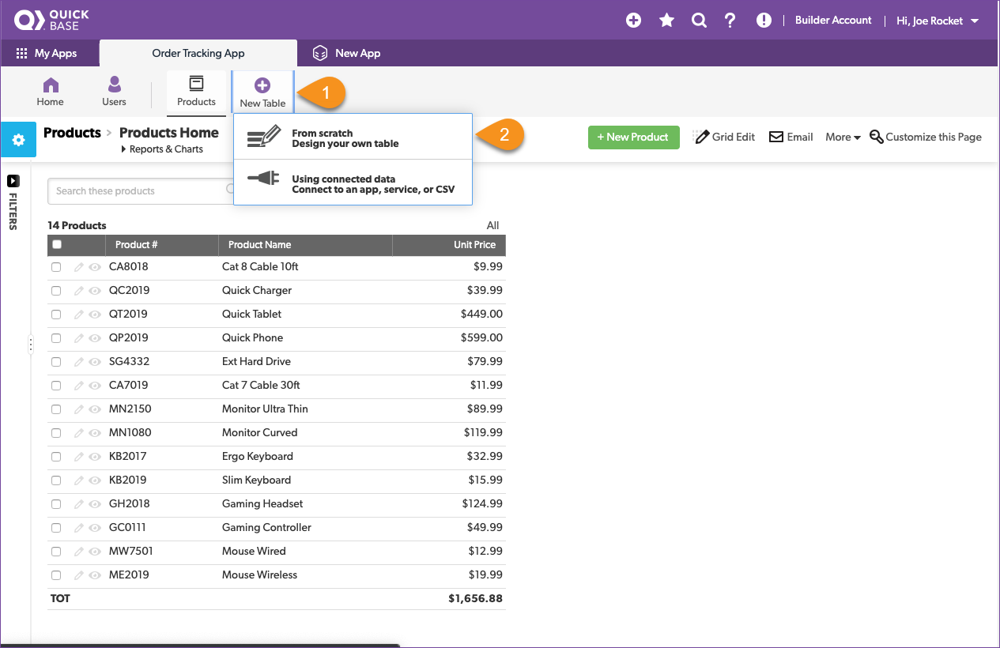
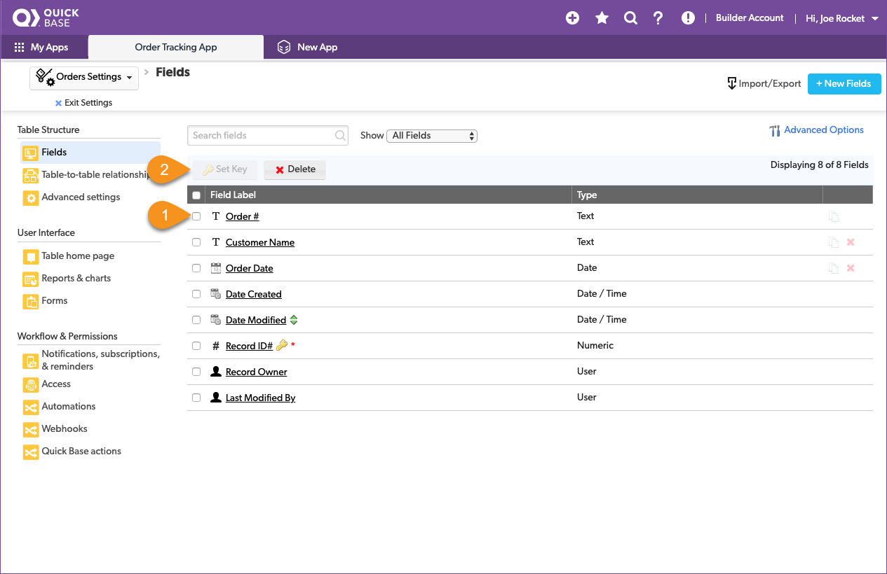

# Storing data in a database

Quick Base allows you to store all of the information from multiple spreadsheets in one app arranged in tables. This way, a piece of information from one table is easily used in another table. We call this related data. When Drew started, all of the order information was stored in one giant spreadsheet. Over time, the spreadsheet became too large and Drew started to break it into smaller, more focused spreadsheets. Drew aligned the spreadsheets with the tasks in the order process then stored just the data required for that task in a table. If information is needed from an earlier step in the process, Drew finds it and copy's it to the other spreadsheet.

Here is how Drew broke the master spreadsheet into smaller pieces.

| Task | Action | Spreadsheet | Table | 
|:-----|:-------|:------------|:------|
| Add a product | Collect the information needed to sell a product | ProductList.xlsx | Products |
| Create an order | Start a new order and register it in the system | OrderList.xlsx | Orders | 
| Add item to order | List the items delivered in the order | LineItems.xlsx | Order Items |

## Review the orders spreadsheet

Moving through Drew's spreadsheets, the next in line is the `OrderList.xlsx` spreadsheet. Again, we'll start by taking a look at the spreadsheet and understanding what is stored inside. Open the `OrdersList.xlsx` file and take notes about its structure.

Reviewing the spreadsheet, you write down the following notes:

| Column | Meaning | Type |
|:-|:-|:-|
| Order Date | The date that the order was placed | date |
| Customer Name | The customer's name| text |
| Order Number | The order number | text |

~~~
    1. Click `New Table` from the app nav bar  
    2. Click `From scratch - Design your own table`
    3. Name the table Orders
    4. Set A single record is called a to Order
    5. Select an icon to represent your table
    6. Provide a description
    7. Click Create
~~~

Ok, now add the fields of the table.

~~~
    1. Create fields to hold the Order #, Customer Name, Order Date 
    2. Set the data types for each field from our notes above
    3. Click the Add button
~~~

Another use for the **key** field is to make sure that duplicates aren't created when adding data to the database. In our case, all of the order numbers are unique, creating an order with the same order number would cause confusion. Set the `Order #` field to be the **key** in the Orders table to make sure that we don't create a duplicate order numbers accidently. 

~~~
    1. Select the checkbox for Order #.
    2. Click `Set Key`
    3. Click the `Set Key` button in the pop-up  
    4. Verify that the gold key moved to the `Order #` field
~~~

## Import the orders spreadsheet

Finally, import the orders from the OrderList.xlsx file you downloaded earlier. Just like before, the import dialogue box opens and gives you the opportunity to verify that the data will stored correctly. Review the information and import your data.

~~~
    1. Click the `Import/Export` button
    2. Select Import into a table from a file
    3. Confirm Select Table is set to Orders and Select Merge Field is set to Order #
    4. Review how each field will be imported to ensure it is correct
    5. Click the Import button
    6. Click OK
~~~

A page shows the results: 67 data rows were read, 67 new records were created, 0 existing records were updated, and there were 0 data rows with errors. The import was successful, and your app now contains the data from the `OrderList.xlsx` file. 

Click on the `Orders` table in the table nav and review the data that was imported.

[Next](relationships.html){: .btn .btn-purple }
