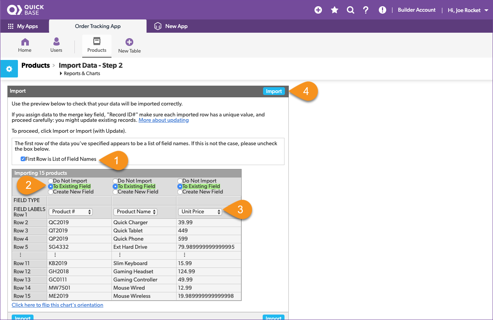
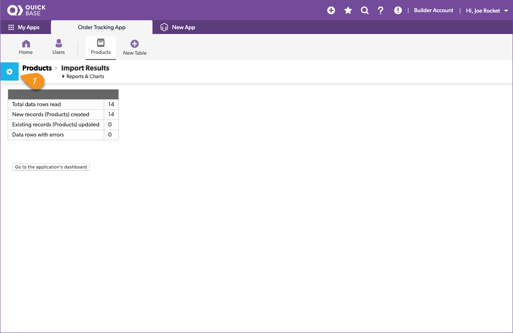
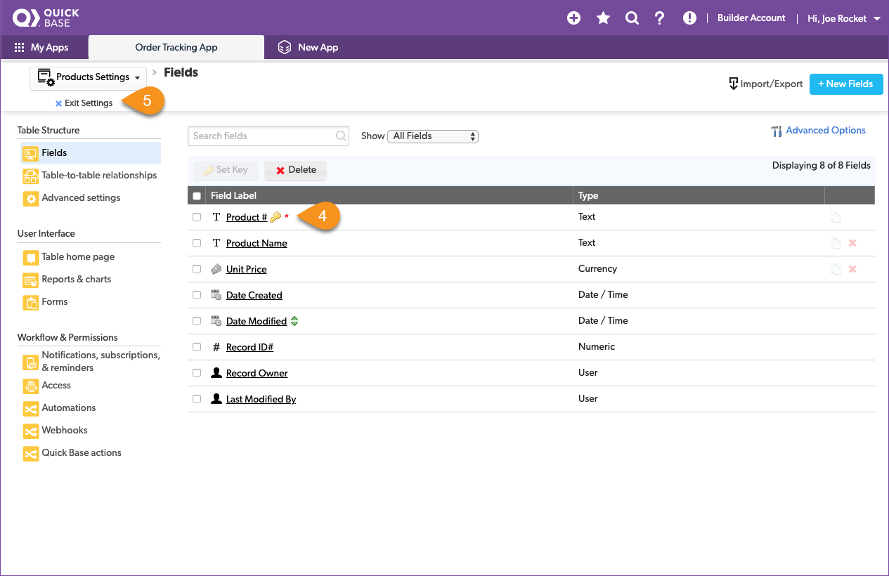

# Create your first Quick Base table

Quick Base stores data in tables. Tables are like spreadsheets, but better. Tables organize data in rows and columns, and you can use data from one table in another, so you don't have to copy and paste or reenter data like Drew did. Understanding how tables work is the first step in your app building journey.  

## Review the product list spreadsheet

Drew provided 3 spreadsheet files. Since our first goal is to correct a product name, let's start with the Product List spreadsheet. Opening the `ProductList.xlsx` file, we see that it has data in 3 columns, and the name of each column is stored in the first row.  

Reviewing the spreadsheet, you write down the following notes:

| Column | Meaning | Type |
|:-|:-|:-|
| Product # | The product SKU | text |
| Product Name | The name of the product | text |
| Unit Price | The price | currency |

To add a table to Quick Base, first you describe what a table is going to store before filling it with data. Let's take what we learned from the spreadsheet and configure a table to hold the product information. Let's get started!
1. Click the **New Table** button from the table navigation bar. 
2. Select **From scratch — Design your own table.**

Configure the table by giving it a name, record name, icon, and a description to describe how it's used.

1. Name the table: _Products_
2. A single record is called a: _Product_
3. Select an icon to represent your table — we chose the first suggested icon
4. Provide a description: _List of products we sell_
5. Click the **Create** button

Great! Creating the table is the first half of the configuration process. Next, add fields to the table and identify what kind of data they store. Remember, field names are like the column headers in a spreadsheet. We'll add the fields based on what we observed in Drew's spreadsheet.  

1. Fill in a field label for each of the column names from the spreadsheet
2. Select the data type for each field based on what we observed
3. Click the **Add** button

> **Congratulations!** You just created your first Quick Base table!

Now you know the steps to create and configure any table that you want in Quick Base. You can return to the **Fields** settings page anytime to make changes.

## Import the products spreadsheet

Now that we have a place to store our data, let's import the products from the ProductList.xlsx file that Drew gave us.

1. In the top right section of the page, click **Import/Export** 
2. In Choose Action, click **Import into a table from a file**
3. Leave Select Merge Field set to Record ID#
4. Click the **Choose file** button and navigate to the _ProductList.xlsx_
5. Click **Import from file**

The **Import** dialogue allows you to configure how the file is imported.

Now that we have set the configuration let's look at how it will be iimported.

1. The first row of Drew's spreadsheet contains the field names. Make sure this is checked.
2. We've already defined the fields and we want the data imported to them
3. Look at the data and field names and make sure they match the spreadsheet
3. Click the **Import** button

Once all the data is loaded, the import results page opens to show the results: 14 rows were read, 14 records were added, no records were updated, and there were no data rows with errors. 

> **Success!** You've imported your first spreadsheet to Quick Base. 

As an aside, what do you think would happen if you accidentally uploaded that same spreadsheet with the same list of products into the app a second time? Would every product appear in the table twice, like shown here?

Yes, and we don't want that! Quick Base requires that each table contains 1 field to use as a unique value for each record. This field is called the _key field_. If the uploaded data contains the same value of an item in the key field, it'll update the record instead of adding a new one. In our example, if Product # is the key field and the table already contains a record with `Product #` QC2019, Quick Base won't add another record with this value during an upload. Instead, it'll update the existing record. This is a convenient way to quickly update values of many existing records, such as when you need to update pricing.

By default, Quick Base automatically creates a `Record ID#` field for every table and sets it as the **key field.** This is useful if your data doesn't contain a field that will always contain unique values. But because our Product # is always a unique SKU, we can make that the key field and avoid duplicate entries in the future.

We are already on the Products table so we just need to go to the Products table's settings to change it. Here's how:

1. Click the gear icon in the blue box next to the **Products > Products Home** breadcrumb
2. Click **Fields (8)** in the **Table Structure** group

Let's set the **Product #** field to be the **key** for the Products table.

1. Select the checkbox for **Product #**
2. Click **Set Key**
3. Click the **Set Key** button in the pop-up  
4. Verify that the gold key moved to the _Product #_ field 
5. Click **Exit Settings**.

Your future self will thank you for setting this up now. 

## View the table report

Ok, almost done with the Products table. Our last step is to take a look at what was imported and update that mislabeled product name! Start by clicking the Products table icon to view the homepage for this table. Note that whenever you click a table button in the table nav bar, it will display the default _table report_ on the table's **Home** page. 

## Update a record

We're looking for Product # `CA8018` which has the wrong product name `Cat 9 Cable 10ft`. It should be a Cat 8 cable. With the table report open, we quickly spot the wrong product name. We can correct the product name in the product list from the home page. 

1. Click the **Grid Edit** button in the app nav bar 
2. Double click the wrong product name
3. Correct the product name
4. Click the green **Save** button
5. Verify that the product name was updated 

In just a few clicks, you updated the product name. From now on, it'll be correct in all the orders. Notice that the updated record is now at the top of the table. This is because the default sort order the **last modified by** field.

[Next](createOrders.html){: .btn .btn-purple }
