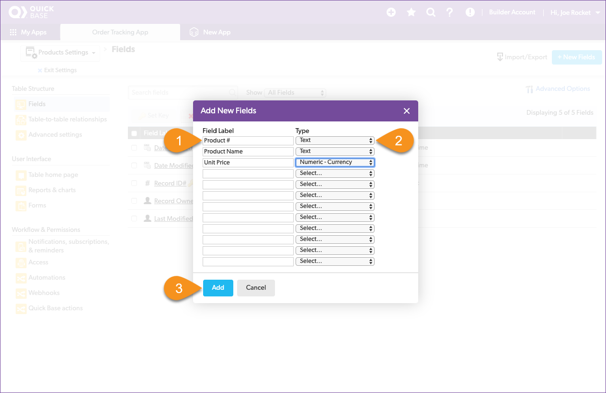
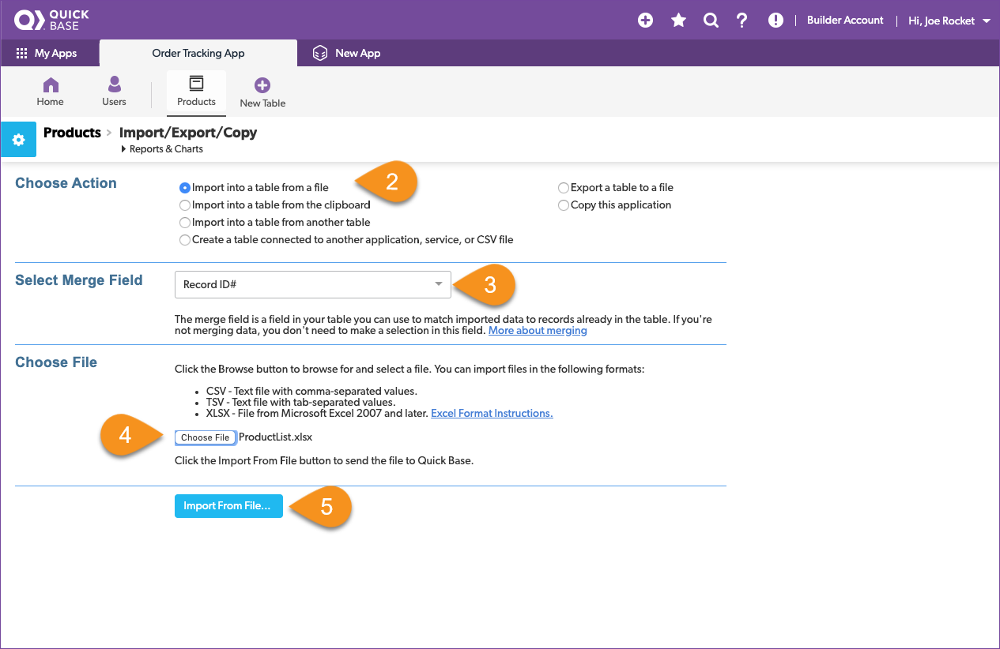
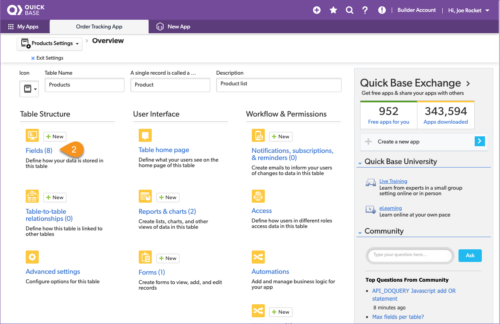
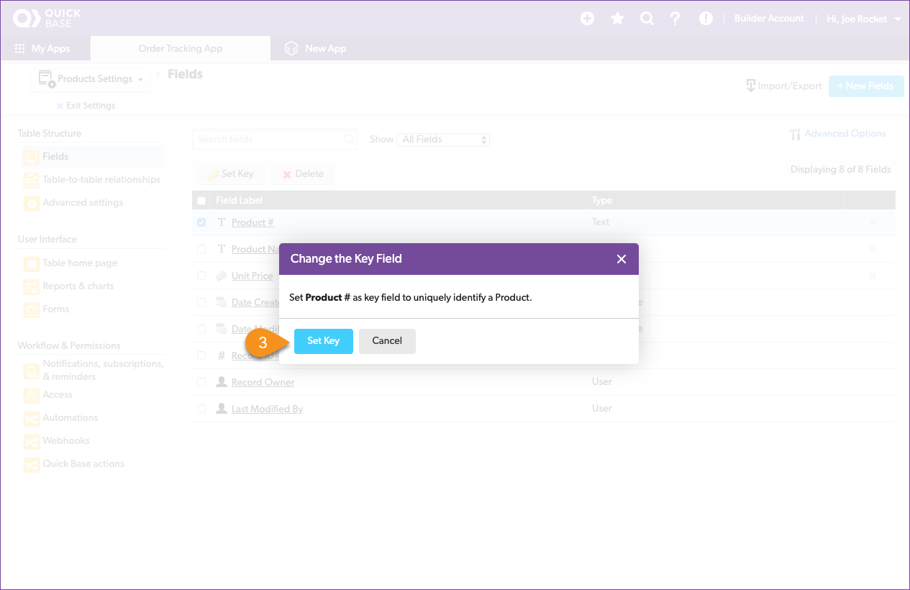
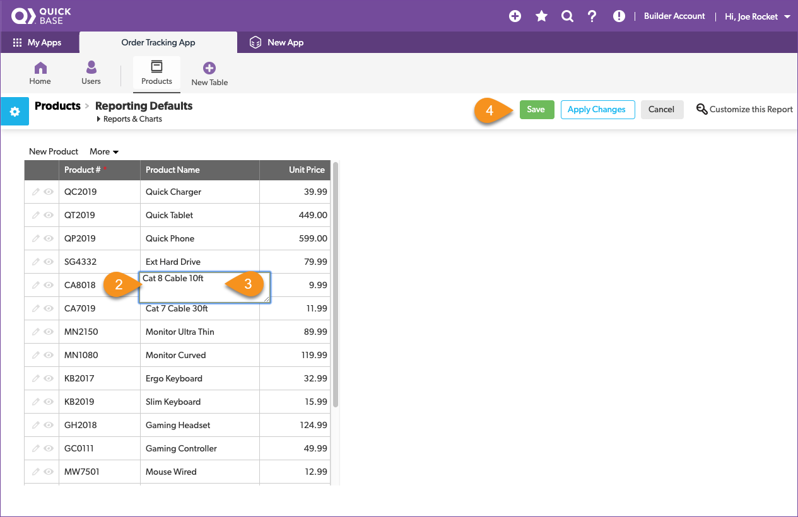

# Create your first Quick Base table

Quick Base stores data in tables. Tables are like spreadsheets, but better.  Understanding how tables work is the first step in your journey to creating an app.  

## Review the product list spreadsheet

Drew provided three spreadsheet files, and since our first goal is to correct a product name, let's start with the Product List spreadsheet. Opening the `ProductList.xlsx` file, we see that it has data in three columns, and the name of each column is stored in the first row.  

Reviewing the spreadsheet, you write down the following notes:

| Column | Meaning | Type |
|:-|:-|:-|
| Product # | The product SKU | text |
| Product Name | The name of the product | text |
| Unit Price | The price | currency |

To add a table to Quick Base, first you describe what a table is going to store before filling it with data. Let's take what we learned from the spreadsheet and configure a table to hold the product information. Start by clicking the **New Table** button from the table navigation bar. 

Then select **From scratch - Design your own table.**

Configure the table by giving it a name, record name, icon, and a description to describe how it's used.

~~~
    1. Name the table: Products
    2. A single record is called a: Product
    3. Select an icon to represent your table - we chose the hand cart
    4. Provide a description: List of products we sell
    5. Click the `Create` button
~~~

Great! Creating the table is the first half of the configuration process, next, add fields to the table and identify what kind of data they store. We add the fields based on what we observed in Drew's spreadsheet.  

~~~
    1. Fill in a `Field Label` for each of the column names from the spreadsheet
    2. Select the data type for each field based on what we observed
    3. Click the `Add` button
~~~

> **Congratulations!** You just created your first Quick Base table!

Now you know the steps to create and configuration any table that you want in Quick Base. You can return to the **Fields** settings page at any time to make changes.

## Import the products spreadsheet

Now that we have a place to store our data, let's import the products from the ProductList.xlsx file that Drew gave us:

~~~ 
    1. In the top right section of the page, click `Import/Export`
    2. In Choose Action, select `Import into a table from a file`
    3. Leave Select Merge Field set to Record ID#
    4. Click the `Choose File` button and navigate to the `ProductList.xlsx`
    5. Click the `Import From File...` button
~~~

The **Import** dialogue allows you to configure how the file is imported

    1. The first row of Drew's spreadsheet contains the Field Names, make sure this is checked.
    2. We have already defined the fields and we want the data imported to them
    3. Look at the data and field names and make sure they are like the spreadsheet
    3. Click the `Import` button

Once all of the data is loaded, the import results page opens to show the results: 14 rows were read, 14 records were added, no records were updated, and there were no data rows with errors. 

> **Success!** You have imported your first spreadsheet to Quick Base

As an aside, what do you think would happen if you accidentally uploaded that same spreadsheet with the same list of products into the app a second time ... would every product appear in the table twice, like shown here?

YUP! (and we don't want that!) Quick Base requires that each table contains one field to use as a unique value for each record, this field is called the _key field_. If the uploaded data contains the same value of an item in the key field, it will update, vs. add, the record.  In our example, if Product # is the key field and the table already contains a record with `Product #` QC2019, Quick Base will not add another record with this value during an upload.  Instead, it will update the existing record.  This is a convenient way to quickly update values of many existing records, such as when you need to update pricing.

By default, Quick Base automatically creates a `Record ID#` field for every table and sets it as the **key field.**  This is useful if your data does not contain a field that will always contain unique values.  But because our Product # is always unique SKU, we can make that the key field and avoid duplicate entries in the future.

Here's how:

~~~
    1. Click the icon for the Products table in the table nav bar
    2. Click the gear icon in the blue box next to the `Products > Products Home` breadcrumb
    3. Click `Fields (8)` in the **Table Structure** group
~~~

Let's set the `Product #` field to be the **Key** for the Products table.

Select the checkbox for `Product #`

Click `Set Key`

Click the `Set Key` button in the pop-up  

Verify that the gold key moved to the `Product #` field then click `Exit Settings`.

Your future self will thank you for setting this up now. 

## View the Table Report

Ok, almost done with the Products table. Our last step is to take a look what was imported and update that pesky product name! Start by clicking the the Products table icon to view the homepage for this table. Note that whenever you click on a table button in the app nav bar, it will display the default _table report_ in the table's **Home** page. 

## Update a Record

We are looking for Product # `CA6018` which has the wrong product name `Cat 9 Cable 10ft`, this is really a Cat 6 cable. With the Table Report open, we quickly spot the wrong product name, we can correct the product name in the product list from the home page. 

~~~
    1. Click the `Grid Edit` button in the app nav bar 
    2. Double click on the wrong product name
    3. Correct the product name
    4. Click the green Save button
    5. Verify that the product name was updated 
~~~

In just a few clicks, you updated this product name in the products table now it will be correct in all of the orders.

[Next](createOrders.html){: .btn .btn-purple }