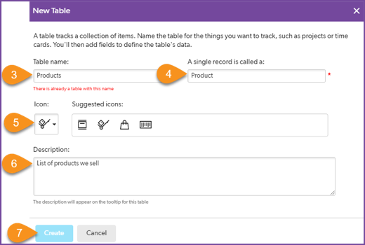

# Add Data to the App

Now it’s time to get the data into the app.  Data is stored in tables.  Tables are like spreadsheets, but better.  You can use them in a way that greatly reduces data entry and maintenance.  

## Create a Products Table

Drew's `ProductList.xlsx` spreadsheet has three columns:  Product #, Product Name, and Unit Price. Here’s a look at the first four records in the spreadsheet.  

Begin by creating a table to contain the product list data. 

  

~~~
    1. Select + New Table.  
    2. Select From scratch - Design your own table.
    3. Name the table Products.
    4. Set A single record is called a to Product.
    5. Select an icon to represent your table. 
    6. Provide a description such as List of products we sell.
    7. Select Create.
~~~

Next add the fields of the table.  These correlate to the column headings in the spreadsheet. 

~~~
    1. Enter field labels Product Name, Product #, and Unit Price. 
    2. Set the data types Text, Text, Numeric-Currency, respectively, as shown above.
    3. Select Add. 
~~~

## Congratulations! 
You have designed the first table in this app.  You added three fields and Quick Base added some standard fields that are added to every new table, such as Record ID.  

Soon you will upload the data from the Products List spreadsheet into the table.  Imagine what would happen if you accidently uploaded that same spreadsheet with the same list of products into the app a second time!  Would every product appear in the table twice, as shown here?

No, because Quick Base requires each table to include one field that contains a unique value for each record, called the key field. This field ensures that records that are identical in every other way always have a unique identifier. If the upload of data contains the same value of an item in the key field, it will update, vs. add, the record.  In our example, if Product # is the key field and the table already contains a record with Product # QC2019, it will not add another record with this value during an upload.  Instead, it will update the existing record.  This is a convenient way to quickly update values of many existing records, such as when you need to update pricing.

By default, Quick Base automatically creates a Record ID# field for every table and sets it as the key field.  This is useful if your data does not contain a field that will always contain unique values.  But in our example, Product # is always unique, so make that the key field:

~~~
    1. Select the checkbox for Product #.
    2. Select Set Key.
    3. Follow the prompts (not shown above) to confirm this change. 
       The key icon should now be beside the  Product # field.  
    4. Select Exit Settings in the top left section of the screen.
~~~

You can now add data to the Products table. 

## Add a Product Using the + New Product Button

Add a Product Using the + New Product Button
Before importing data from spreadsheets, experience what it’s like to add data using the button in the user interface. Add one product to the product table using the convenient button Quick Base added when you created the table:

~~~
    1. Select + New Product.  
    2. Type product name Flash Drive 64GB.
    3. Type product # FD0064.
    4. Type unit price 12.99.
    5. Select Save & Close.
~~~

## Import Products from the File

Now import the rest of the products from the Product List.xlsx file you saved earlier:

~~~
    1. Select the Products table icon to view the homepage for this table.  
    2. In the top right section of the page, select More>Import/Export.
    3. In Choose Action, select Import into a table from a file. 
    4. Confirm Select Merge Field is set to Product #.
    5. Without detailed instructions, upload the copy of Product List.xlsx you saved to your computer. 
~~~

After you select Import From File…the system displays a warning alerting you that importing data into a table that already contains data may update existing records. In this exercise, there is only 1 product in the table – the flash drive you entered above. This product is not in the spreadsheet, so no items will be updated. Select OK.

The next page displays a preview of your data and acts like a staging area.

1.	Quick Base recognized that the spreadsheet contained field names and inserted those values in FIELD LABELS Row 1 of the table. If this wasn’t correct, you could make the correction now, before the import. But this is correct, so leave First Row is List of Field Names checked. 
2.	Quick Base assumed the spreadsheet data could be imported into existing fields. If this wasn’t correct, you could select Do Not Import or Create New Field. However, this is correct, so leave the radio buttons To Existing Field checked. 
3.	Select Import (with Update). 

A page shows the results: 14 rows were read, 14 records were added, no records were updated, and there were no data rows with errors. Success!

## View the Table Report

Select the Products table icon to view the homepage for this table.  

Notice Quick Base has created a report for you automatically. How thoughtful! It includes all the products you imported and the flash drive you entered in the user interface.

[Next](createOrders.html){: .btn .btn-purple }