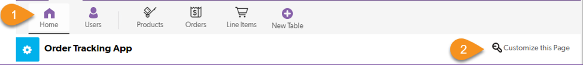
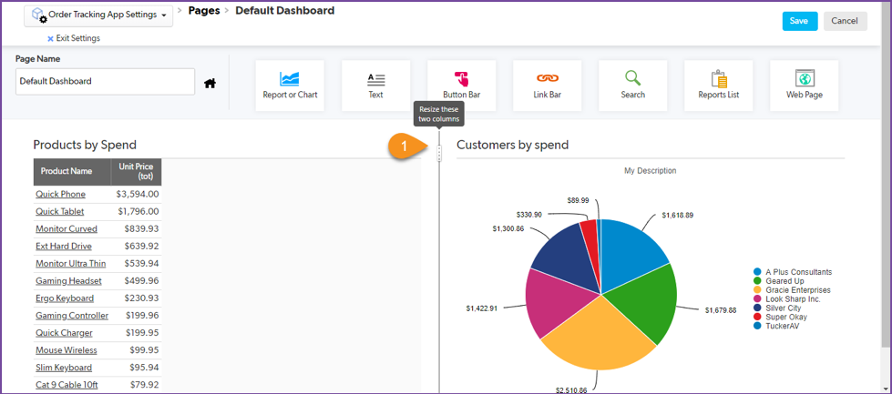
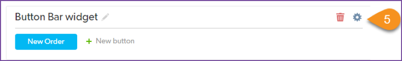
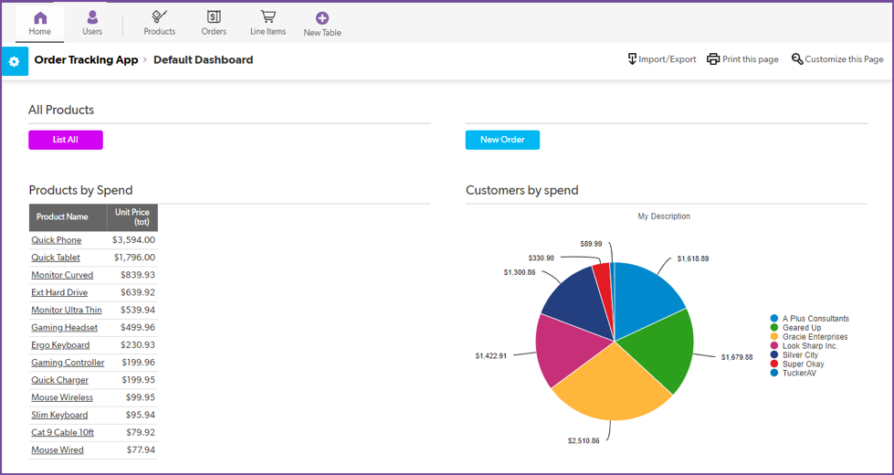

# Create a dashboard

Dashboards give people one convenient place to see or access key information. It is what people see when they first sign into an app. You can create different dashboards for different roles. 

Put both reports you created for the Vice President on the dashboard so she can easily access this information from her own computer at any time. 

## Add Reports to the Dashboard

Follow the steps below to turn the app Home page into the main dashboard:

    1. Select the app Home page.
    2. Select Customize This Page. A gallery of widgets is displayed. 
    3. Drag and drop the Report or Chart widget from the top of the page to a spot on the page below. 
    4. When you release the mouse, look to the upper-right to choose the report to display. Reports and charts are grouped by table. Locate the Line Items table in the list and select Customers by Spend. 
    5. Drag and drop the Report or Chart widget from above to the spot next to the Customers by Spend pie chart. Without detailed instructions, set this widget to the Products by Spend report. 
 
## View the new dashboard. 
 

    1. If one report is a lot smaller than the other, hover your mouse between the reports to make the resizer appear. Drag it left or right to resize the reports to your liking. 

## Add Buttons to the Dashboard

Add a button that lets users create new orders directly from the dashboard:

    1. Drag and drop the Button Bar widget from the top to a spot above the reports.
    2. A  popup window displays. At the top, there are three options for button type: New Record, Report, or Page. Leave the default value of New Record. 
    3. In the New Record dropdown, select Order. 
    4. Close this popup window.  
    5. Hover your mouse over the widget’s top right corner to make the gear icon appear. Select this gear and deselect Show a Title.

Add a button that lets users view a report showing all products:

    1. Drag and drop another Button Bar widget from the top to a spot to the left of the New Order button. 
    2. At the top of the popup window, select Report at the top.
    3. Set Report to Products > List All. 
    4. Close the popup window.
    5. Put your cursor over this List All button to make the pencil icon appear. Select this pencil icon and change the label to All Products and select the green checkmark to save the change.
    6. Hover your mouse over the widget’s top right corner to make the gear icon appear. Select this gear and click the blue swatch to change the button color to another color, like magenta. 
    7. Close the popup window. 
    8. Select Save.

Look at that! You now have a single dashboard that allows users to view how much customers are spending, what products are selling the most, a button to the view the product list, and a button to create a new order. Now that’s convenience!

[Next](conclusion.html){: .btn .btn-purple }