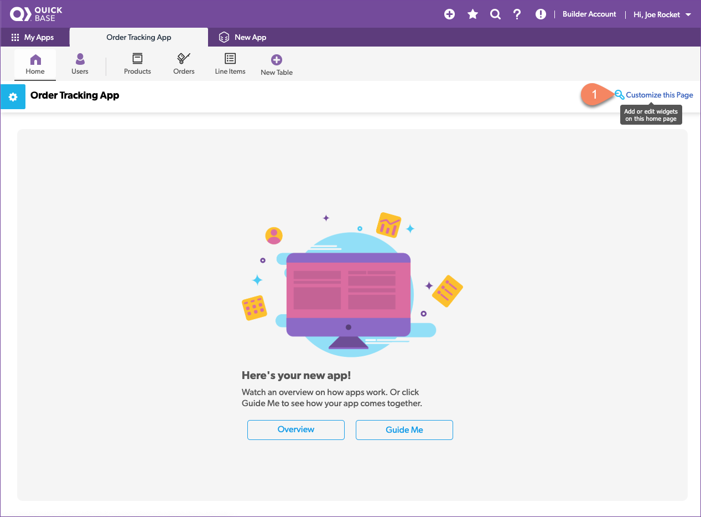

# App Dashboard

Dashboards give people one convenient place to see or access key information. It is what people see when they first sign into an app. You can create different dashboards for different roles. 

## Add the orders summary report

## Add the customer by spend report

## Add the product by revenue report

... save
{: .label .label-yellow}

## Add a create new order button

Add a button that lets users create new orders directly from the dashboard:

    1. Drag and drop the Button Bar widget from the top to a spot above the reports.
    2. A  popup window displays. At the top, there are three options for button type: New Record, Report, or Page. Leave the default value of New Record. 
    3. In the New Record dropdown, select Order. 
    4. Close this popup window.  
    5. Hover your mouse over the widget’s top right corner to make the gear icon appear. Select this gear and deselect Show a Title.

Look at that! You now have a single dashboard that allows users to view how much customers are spending, what products are selling the most, and a button to create a new order. Now that’s convenience!

[Next](conclusion.html){: .btn .btn-purple }