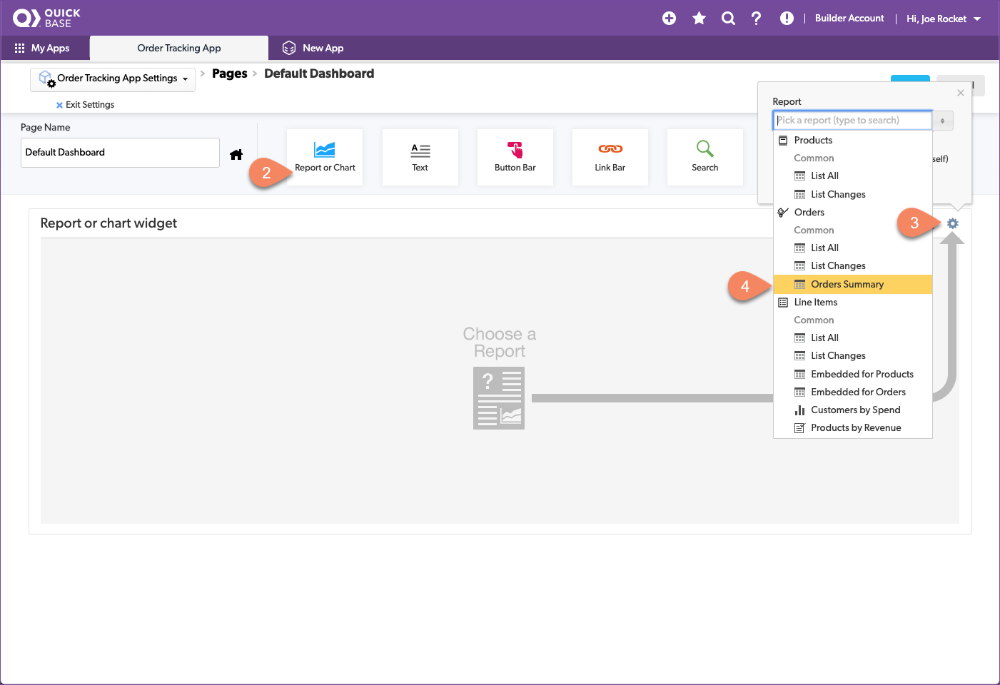
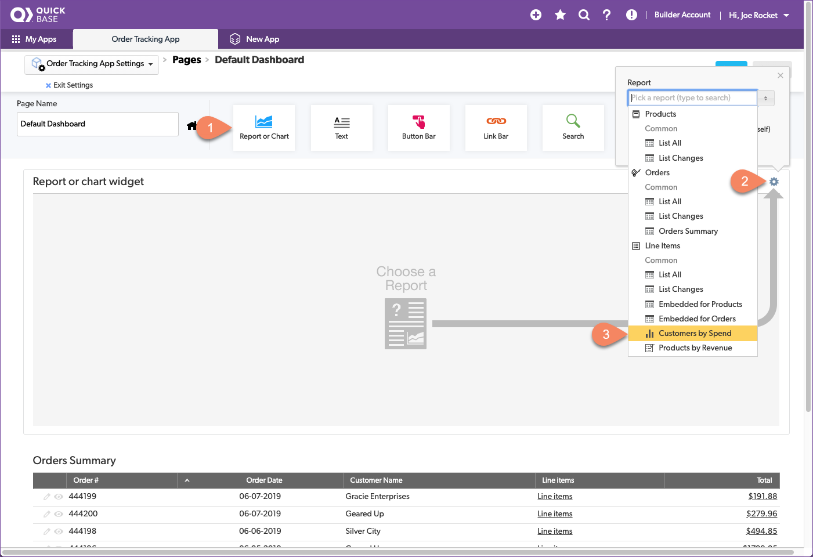

# App dashboard

Dashboards give people one convenient place to see or access key information. It's what people see when they first sign into an app. You can create different dashboards for different roles. For now, we're going to create one dashboard for everyone. We have 3 reports from earlier. Let's get them into the dashboard. 

## Add the orders summary report

The orders summary table report is a good way for anyone to see information about orders and drill into the line item that the customer purchased. Since this report is the foundation of our dashboard, let's configure a home for it first.

1. Click **Customize this Page**
2. Click and drag the **Report or Chart** widget onto your page
3. Click the icon gear
4. Select the **Orders Summary** report

That looks awesome! Now every time your **Order Tracking** app is opened, the report will automatically update and display. 

** ADD SCREENSHOT**

## Add the customer by spend report

The next report to add is the bar chart displaying customer spend. 

1. Click and drag the **Report or Chart** widget onto your page
2. Click the icon gear
3. Select the **Customer by Spend** chart

## Add the product by revenue report

Last but not least is the product revenue summary report. 

1. Click and drag the **Report or Chart** widget onto your page
2. Click the icon gear
3. Select the **Product by Revenue** report

Looking good!

## Add a create new order button

Hey, while we're here and have the dashboard editor open, let's go ahead and add a button that allows anyone to create new orders directly from the dashboard. That'll make it a lot easier for your team to get right into the order entry form with just one click!

1. Drag and drop the **Button Bar** widget from the top to a spot above the reports to open a pop-up window
2. Leave the default value for the button set to **New Record** 
3. In the New Record drop-down, select **Order**
4. Close this pop-up window  
5. Hover your mouse over the top right corner of the widget to make the gear icon appear. Select this gear and deselect **Show a Title.**
6. Click **Save**

Look at that! You now have a single dashboard that allows users to view how much customers are spending, what products are selling the most, and even a button to create a new order. Now that’s convenience!

[Next](conclusion.html){: .btn .btn-purple }
