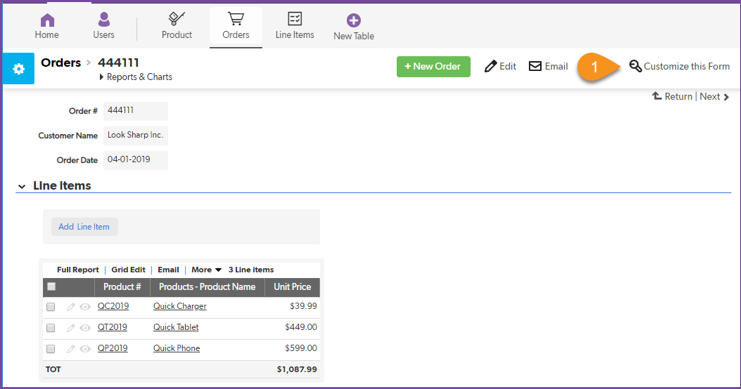
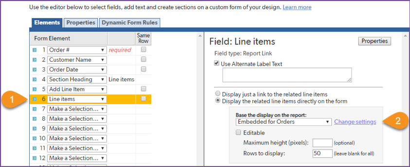
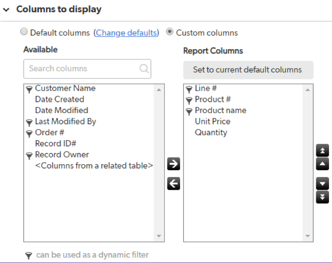
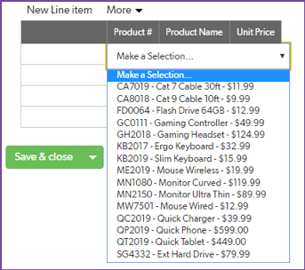
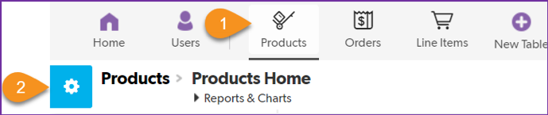
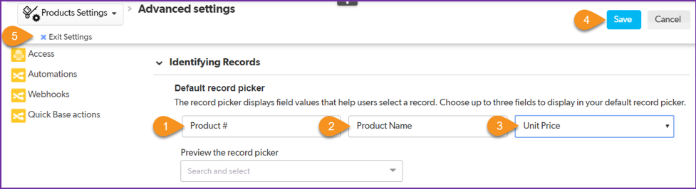

INTRO
{: .label .label-red}

Check out the power of table relationships by viewing an order:

SCREENSHOT
{: .label .label-red}

~~~
    1. Select the Orders table.  
    2. Select order 444111 to view it. 
    3. All three line items for this order are displayed.
~~~

The order’s information is displayed on a form. The top of the form shows the fields for order number, customer name, and order date. The bottom of the form is a report that is pulling data from the Line Items table. Behind the scenes, Quick Base created this report and named it Embedded for Orders because it is embedded on the Orders form. The report is good, but notice that line items and quantities are not displayed. So you need to make a minor adjustment to this report. 

# Order Form Design

Modify the report on this form to add the fields Line Item and Quantity.

~~~
    1. Select Customize this Form.
~~~

The editor to modify the form is displayed. You want to edit the embedded report on this form that displays line items:

~~~
    1. In the Form Element list, select the 6 beside Line Items.
    2. Select Change settings to modify the embedded report on this form. This action may open a new browser window.
~~~

~~~
    3. Scroll down to the Columns to display section, and move the Quantity and Line # fields to the Report Columns box, and then rearrange the fields using the up/down arrows so they are in this order (shown above): Line #, Product #, Product Name, Unit Price, Quantity. 
    4. Select Save.
    5. If a new browser window opened per step 2 above, close this second browser window. 
~~~

You should still be viewing the editor for the Orders main form. Users of this app will use the Orders form to create new orders. Make some additional changes to make it more user-friendly.

~~~
    1. The element for Line Items should still be highlighted. If not, select the 6 beside it. 
    2. In the Field: Line items section on the right, select the checkbox for Editable.  
    3. Under Form Element, highlight Add Line Item by selecting the number 5 next to it. 
    4. Select the Remove button at the bottom of the Form Elements section to take this field off the New Order form. 
    5. Select Save.
~~~

Confirm the order now displays line items and quantities. 
 
## Add Pickers
Make it easy for your app users to add the right products to an order. You do this by choosing what fields to display in the dropdown menu that displays when users add orders. The info helps them decide what record to pick – hence the term record picker. Modify the form to include three record pickers: Product Number, Product Name, and Unit Price, as shown below. Showing all three fields is better than showing just one or two. So read on, and you’ll learn how to create a dropdown that looks like this!

View the Products table settings:

~~~
    1. Select the Products table.
    2. Select the settings icon.
~~~

Within Products Settings, select Advanced Settings in the lower-left section of the page, and do the following in the Identifying Records section:

~~~
    1. Confirm the first record picker defaulted to Product #. Do not change it. 
    2. Set the second record picker to Product Name.
    3. Set the third record picker to Unit Price. 
    4. Select Save.
    5. Select Exit Settings. 
~~~

## Add a New Order

Test out your modified form by adding a new order.

~~~
    1. Select the Orders table.
    2. Select the + New Order button.
    3. Enter an order, choosing your own values for Order #, Customer and Order Date. 
    4. Type 1 for Line #.
    5. Double-click in the first cell below Product # to pick a product. Notice that in the dropdown you can see not only the product number, but the product name and unit price as well. That makes picking the right products easier than if you only had the product name or product number to choose from. Select a product of your choice.
    6. Enter a quantity of your choice. 
    7. Notice how the first row auto-filled with information? That’s the power behind relationships. Optionally add additional line items to this order. 
    8. When you’re done, select Save & close.
~~~

It’s so easy to add new orders, you plan to enable your team members to use this app to enter new orders.

[Next](report.html){: .btn .btn-purple }