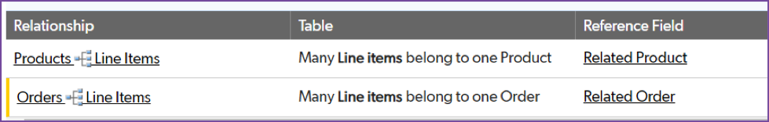

# Understanding related data

Drew kept track of items for each order in the `OrderDetails.xlsx` spreadsheet. Let's open it up and take a look.

| Column | Meaning | Type |
|:-|:-|:-|
| Order # | The order number from the Orders spreadsheet | text |
| Line # |  The line item in the order | number |
| Product # | The product number from the Products spreadsheet | text |
| Product Name | The product name from the Products spreadsheet | text |
| Unity Price | The Unit Price from the Products spreadsheet | currency |
| Quantity | The quantity of items for this order | number |

This time, as you review the spreadsheet, you recognize field names that are shared with the other spreadsheets. This is the information that Drew copied and pasted from spreadsheet to spreadsheet. By defining table relationships in Quick Base, the system can automatically get the related information from one table and display it in another by configuring a **table to table** relationship. Let's do that now. 

## Create the Line Items Table

We are going to create the `LineItems` table a little different then we did with the `Products` and `Orders` tables. Some fields in the `LineItems` table will have relationships with information stored in either the `Products` or `Orders` table. We will create the table and define the relationships firs. 

SCREENSHOT
{: .label .label-red}

~~~
    1. Select + New Table.  
    2. Select From scratch - Design your own table.
    3. Name the table Line Items.
    4. Set A single record is called a to Line Item.
    5. Select an icon to represent your table. 
    6. Provide a description such as This table tracks line items and connects orders and products.
    7. Select Create.
~~~

When the **Add New Fields** dialogue opens, click `Cancel` so that we can define the relationships first. The fields automatically created by Quick Base for every table are displayed. Shortly, you’ll import the `OrderDetails.xlsx` file containing the line item detail, and this will automatically create some fields for you!

But first, you need to build table-to-table relationships between the Line Items table, the Products table, and the Orders table. Once you master how to build table-to-table relationships, you will fully realize the power of Quick Base. 

## Relate the line items and products tables

When adding line items to an order, you want to be able to simply pick a product number from a dropdown list and have the associated product name and unit price auto-fill for you. To make this work, connect the Line Items table to the Products table using a table-to-table relationship.

SCREENSHOT
{: .label .label-red}

~~~
    1. In the left panel of the Line Items Settings page, select Table-to-table relationships. 
    2. If you see Use new experience at the top right of the page, make sure it is turned on.  
    3. In the top right section, select  
    4. Set Line Items connects to to Products. 
    5. Select the option that indicates Products may have many Line Items and select Next.
    6. Set Lookup 1 to Products-Product Name.
    7. Set Lookup 2 to Products-Unit Price.
    8. Select Create Relationship.
~~~

**Congratulations!** You just created the first table-to-table relationship in this app. 

## Relate the line items and orders tables

Create a table-to-table relationship between the Line Items table and the Orders table. Then you’ll import the Order Details.xlsx file, and line items will automatically connect to the orders in the Orders table.

SCREENSHOT
{: .label .label-red}

~~~
    1. In the top right section, select + New Relationship.  
    2. Set Line Items connect to to Orders.
    3. Select the option that indicates Orders may have many Line Items and select Next. 
    4. On the next page, the reference field for Line Items defaults to Related Order. Do not make any changes. Select Next. 
    5. On the Add Lookup Fields page, set one lookup field to Orders - Customer Name. 
    6. Select Create Relationship. 
~~~

Summarize the screenshot below
{: .label .label-red}

You now have two relationships. This will make creating line items within orders much simpler than manually maintaining a spreadsheet. We can tell you that, but seeing is believing. After you import the existing line items, you’ll create an order from scratch in the user interface. 

## Rename Fields

Now that you’ve connected these tables and added some lookup fields, this is a good time to rename some fields on the Line Items table. Quick Base automatically named some fields Related Products, Related Order, Product – Unit Price, and Order # - Customer Name, but those names might not make sense to users of this app. Rename those fields:

SCREENSHOT
{: .label .label-red}

~~~
    1. In the left panel of the Line Items Settings page, select Fields.
    2. Select Related Products to adjust the field’s properties.
    3. For Label, replace Related Product with Product # and select Save.
    4. Select Related Order to adjust the field’s properties.
    5. For Label, replace Related Order with Order # and select Save.
    6. Without detailed instructions, change the labels of the following 2 fields:
~~~

|From|To|
|:---|:-|
|Order - Customer Name|Customer Name|
|Product - Unit Price|Unit Price|

~~~
    7. Select Exit Settings in the upper-left.
~~~

## Import the line items data

You’ve created the line items table and connected it to both the Products table and the Orders table. Now its time to populate this table with the data from Drew’s spreadsheet. Then you can say goodbye to those spreadsheets!

SCREENSHOT
{: .label .label-red}

~~~
    1. From the Line Items table homepage, select More>Select Import/Export.
    2. Select Import into a table from a file.
    3. Confirm Select Table is set to Line Items, and Select Merge Field is set to Record ID.
    4. Without detailed instructions, import the copy of Order Details.xlsx you saved to your computer.
~~~

The next page displays the preview of your data. Set values as described below:

SCREENSHOT
{: .label .label-red}

THESE INSTRUCTIONS DON'T MAKE ANY SENSE
{: .label .label-yellow}
~~~
    1. Confirm First Row is List of Field Names is checked.
    2. Confirm the Order # column is set to be imported To Existing Field. 
    3. Change the Record Owner column from To Existing Field to Create New Field. 
        a. Confirm the FIELD LABELS value is Line #.
        b. Set FIELD TYPE to Text.
    4. Confirm the Product # column is set to be imported To Existing Field.
    5. Confirm the columns for product name and unit price are set to Do Not Import. That data is already in your Products table. 
    6. Confirm the Quantity column is set to Create New Field
        a. Confirm the FIELD TYPE is set to Numeric. 
        b. Confirm the FIELD LABELS is set to Quantity. 
    7. If other columns appear in your preview, do not import them. 
    8. Select Import. 
    9. A message is displayed warning the import will create 2 new fields. Select OK.
~~~

The resulting page indicates the number of records and fields created. Congrats! Your app now contains all the data from Drew’s spreadsheets. 

SUMMARY
{: .label .label-red}

[Next](orderFormDesign.html){: .btn .btn-purple }