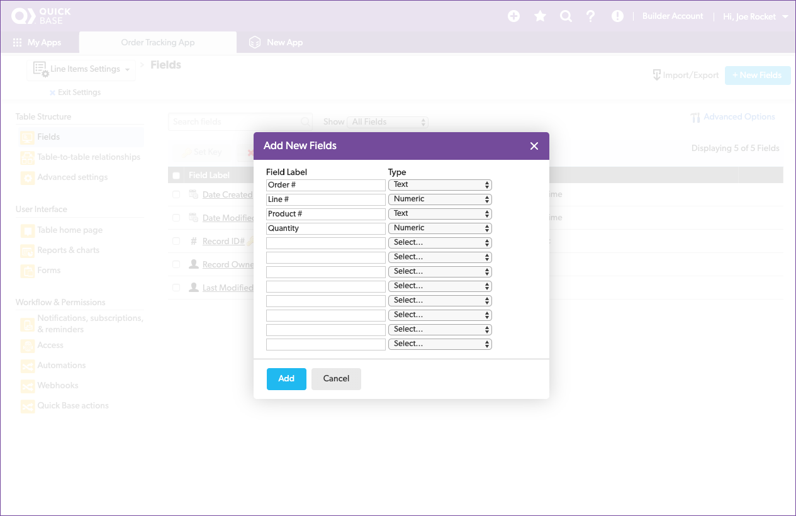
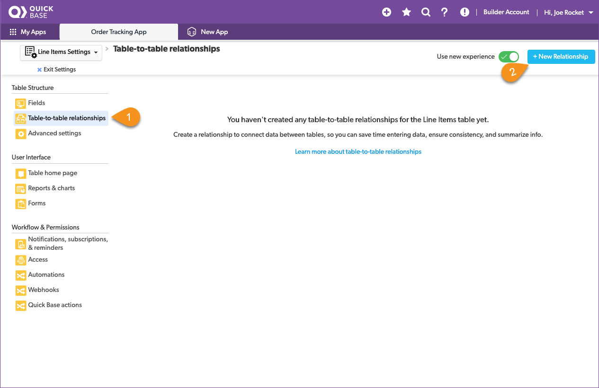
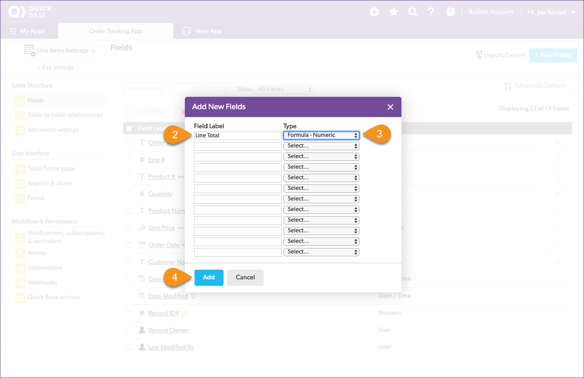

# Understanding related data

Drew kept track of items for each order in the `OrderDetails.xlsx` spreadsheet. Let's open it up and take a look.

| Column | Meaning | Type |
|:-|:-|:-|
| Order # | The order number from the Orders spreadsheet | text |
| Line # |  The line item in the order | number |
| Product # | The product number from the Products spreadsheet | text |
| Product Name | The product name from the Products spreadsheet | text |
| Unity Price | The Unit Price from the Products spreadsheet | currency |
| Quantity | The quantity of items for this order | number |

This time, as you review the spreadsheet, you recognize field names that are shared with the other spreadsheets. This is the information that Drew copied and pasted from spreadsheet to spreadsheet. By defining table relationships in Quick Base, you can automatically get the related information from one table to display on another. Quick Base calls this a **table-to-table** relationship. Let's do that now. 

## Create the line items table

The steps to create the `Line Items` table are a little different from what we did with the `Products` and `Orders` tables. Some fields in the `Line Items` table will have relationships with information stored in either the `Products` or `Orders` table, so we don't have to import that data from the spreadsheet.

Only create fields to hold the data that isn't in the other tables. If the data is in the other tables, we'll use lookups to pull it into this table. 

Start by creating the table:

1. Click **New Table**  
2. Click **From scratch - Design your own table**
3. Name the table: _Line Items_
4. Set A single record is called a: _Line Item_
5. Select an icon to represent your table
6. Provide a description 
7. Click **Create**

When the **Add New Fields** dialogue opens, add any field that is a **key field** in another table or is unique to the line item:

| Column | Meaning | Type |
|:-|:-|:-|
| Order # | The order number from the Orders spreadsheet | text |
| Line # |  The line item in the order | number |
| Product # | The product number from the Products spreadsheet | text |
| Quantity | The quantity of items for this order | number |

This time we accept the default `Record ID#` as the **key field** for the Line Items table.

## Relate the Line Items and Products tables

Each line item in the Line Items table is related to a product in the Products table using the `Product #` field. To avoid typing errors, Quick Base will use this relationship to look up the valid `Product #` and put them into a dropdown list. Choosing an entry from a list is always easier then typing it in by hand. To make this work, connect the Line Items table to the Products table using a table-to-table relationship.

1. Click **Table-to-table relationships** in the Table Structure group
2. Click the blue **New Relationship** button  

Configure the relationship.

1. Set Line Items connects to Products
2. Click the option that indicates Products may have many Line Items
3. Verify that the sentence _Each Product has many Line Items_ appears
4. Click **Next**

Set the `Product #` as the reference field.

1. Set the line items reference field to _Product #_
2. Click **Next**

Identify the lookup fields. 

1. Set Lookup 1 to _Products-Product Name_
2. Set Lookup 2 to _Products-Unit Price_
3. Click the **Create Relationship** button

> **Congratulations!** You just created your first table-to-table relationship! 

## Relate the Line Items and Orders Tables

Create a table-to-table relationship between the Line Items table and the Orders table.

1. Click **Table-to-table relationships** in the Table Structure group
2. Click the blue **New Relationship** button  

Create a relationship with the `Orders` table.

1. Set Line Items connects to to _Orders_
2. Click the option that indicates Orders may have many Line Items
3. Verify that the sentence _Each Order has many Line Items_ appears
3. Click **Next**

Identify the reference field.

1. Set the line items reference field to _Order #_
2. Click **Next**

Identify the lookup fields.

1. Set Lookup 1 to Orders - Order Date
2. Set Lookup 2 to Orders - Customer Name
3. Select the **Create Relationship** button

> **Congratulations!** You have related the Line Items table to the Products and Orders table!

## Rename Fields

Click `Fields` from the Table Structure group. Let's take a look at what happened in when we created those relationships. 

Notice how long some of the field names are. 

**NEED NEW SCREENSHOT**

Let's clean up some of those field names so they're not so long. Here's the process for updating the fields.

**NEED NEW SCREENSHOT**

1. Click the field name that you want to change
2. Change the Label the name listed below
3. Click the green **Save** button

Update each of the fields below.

| From | To |
|:-|:-|
|Product # - Product Name | Product Name|
|Product # - Unit Price|Unit Price|
|Order # - Order Date|Date|
|Order # - Customer Name|Customer Name|

Oh, and since we're here, we should sum up the total for each line in the order. Quick Base uses a formula field to store the sum of two fields from the same record.  

1. Click **New Field** 
2. Field Label: _Line Total_
3. Select type: _Formula - Numeric_
4. Click **Add**

Notice that the Line Total field was added to the table configuration. Quick Base uses [functions](https://login.quickbase.com/db/6ewwzuuj?a=td), field names (which are represented in square brackets), and mathematical operators in formulas. The common mathematical operators are:

| Operator | Symbol |
|:-|:-|
| Addition | + |
| Subtraction | - |
| Multiplication | * |
| Division | / |
    
Let's create the formula now. We want to multiply the quantity by the unit price to get the total for that line item.

 
Click `Line Total` to define the formula. 

1. Click in the formula editor box. The **Choose fields & functions** dropdown appears.
2. Select Quantity field from the dropdown
3. Type a * next to [Quantity] in the editor
4. Select **Unit Price** from the dropdown
5. Verify that the formula is: _[Quantity]*[Unit Price]_

> **Congratulations!** You just created your first formula field! 

Remember that the formula field type is set to numeric, and we are storing currency in the field. We want the field to display as currency. So we'll set how the field is displayed in reports. Scroll down until you see the **Display** section appear in your browser window. 

Configure the following:

1. Change **Decimal places** to 2
2. Change the **Display as** to Currency
3. Click the green **Save** button in the navigation bar

## Import the Line Items data

You’ve created the Line Items table and connected it to both the Products table and the Orders table. We even added a column to hold the total for each line item. Now it's time to populate this table with the data from Drew’s spreadsheet. Then you can say goodbye to those spreadsheets!

1. Click the **Import/Export** button
2. Click **Import into a table from a file**
3. Confirm **Select Table** is set to Line Items, and **Select Merge Field** is set to Record ID
4. Select the OrderDetails.xlsx file
5. Click **Import From File**

Remember, we aren't importing all of the data this time, so make sure that you carefully select what to do with each column. 

1. Configure the import as shown above
2. Select the **Import** button

The resulting page indicates the number of records and fields created.

## Verify the import

Congrats! Your app now contains all the data from Drew’s spreadsheets. Click the `Line Items` table in the table nav and review that everything looks correct.

Verify the following:

* There are no blank fields in the records
* The product # CA8018 displays the correct product name
* The Line Total column is calculating correctly

[Next](report.html){: .btn .btn-purple }
