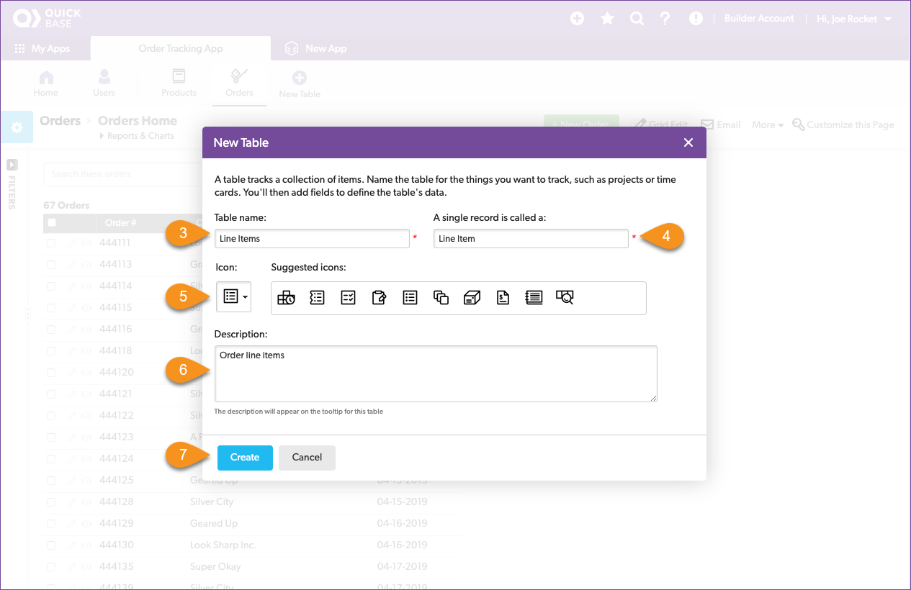
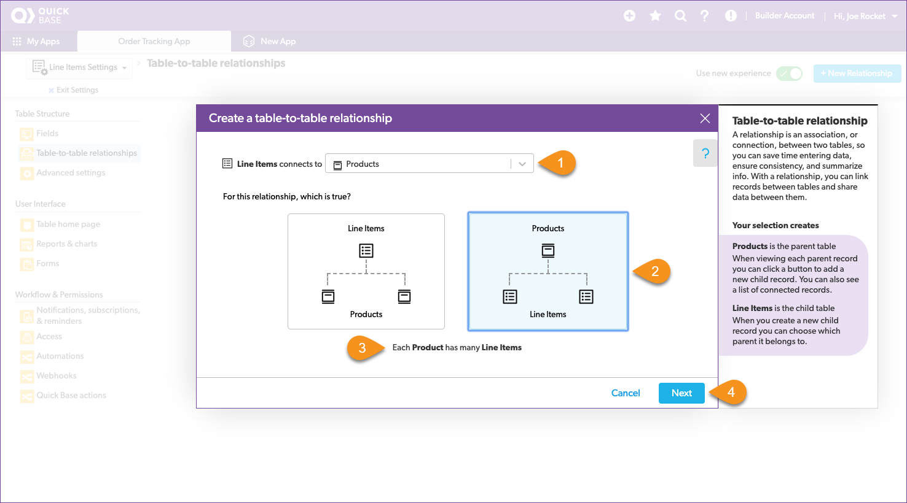
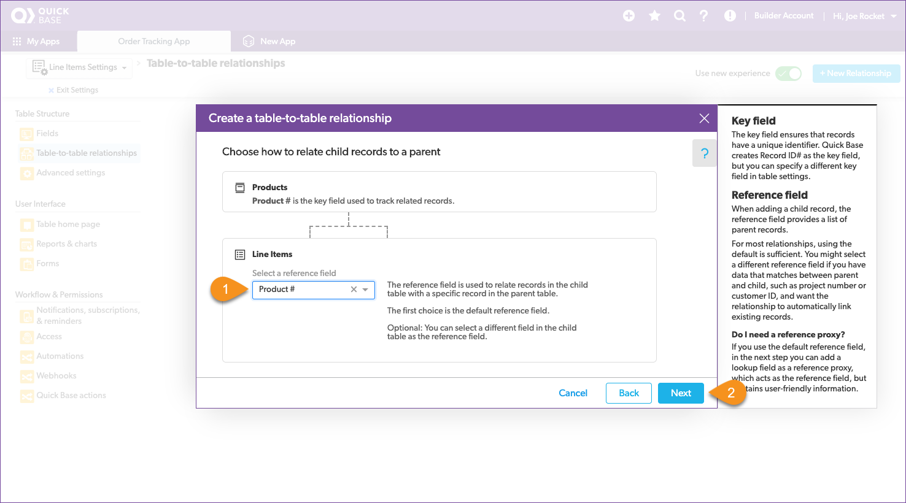
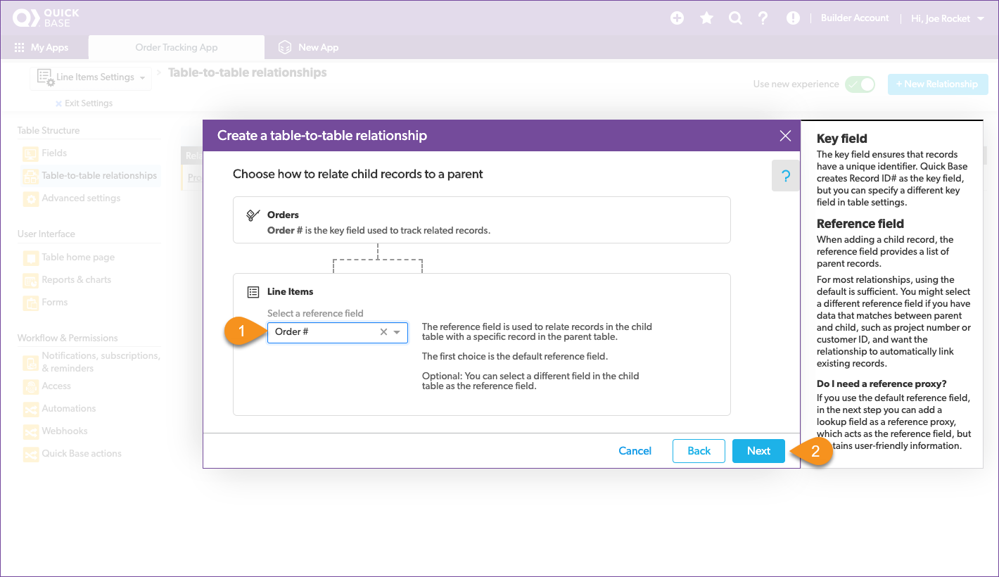
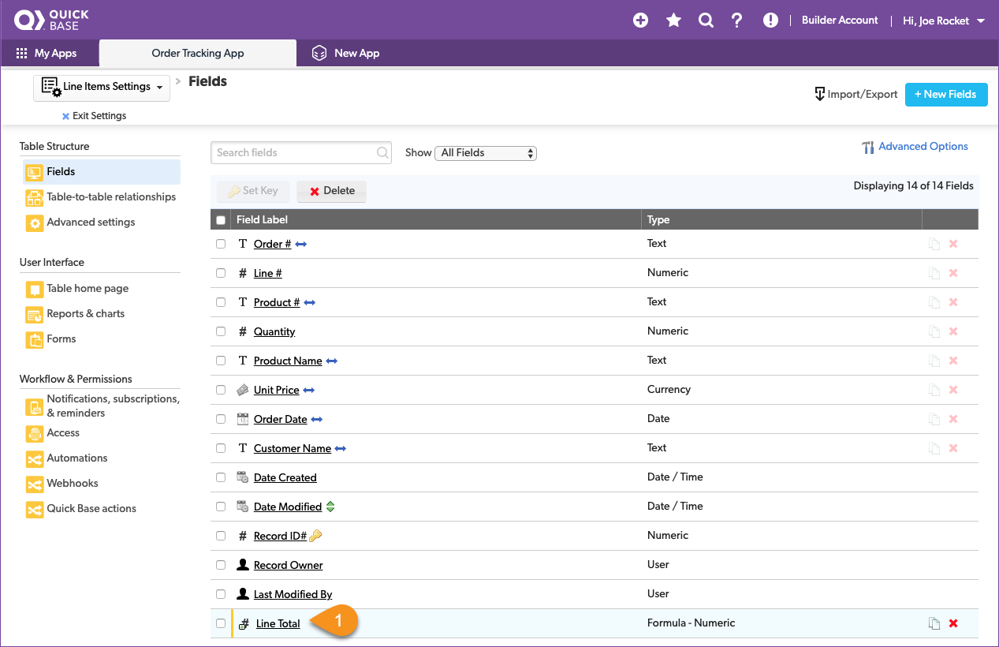
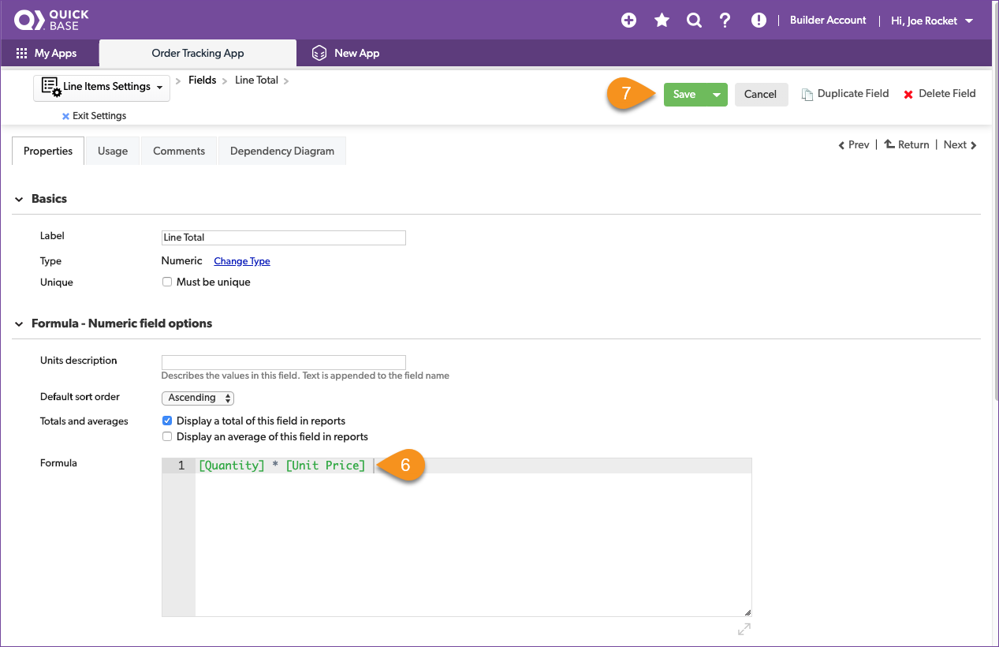
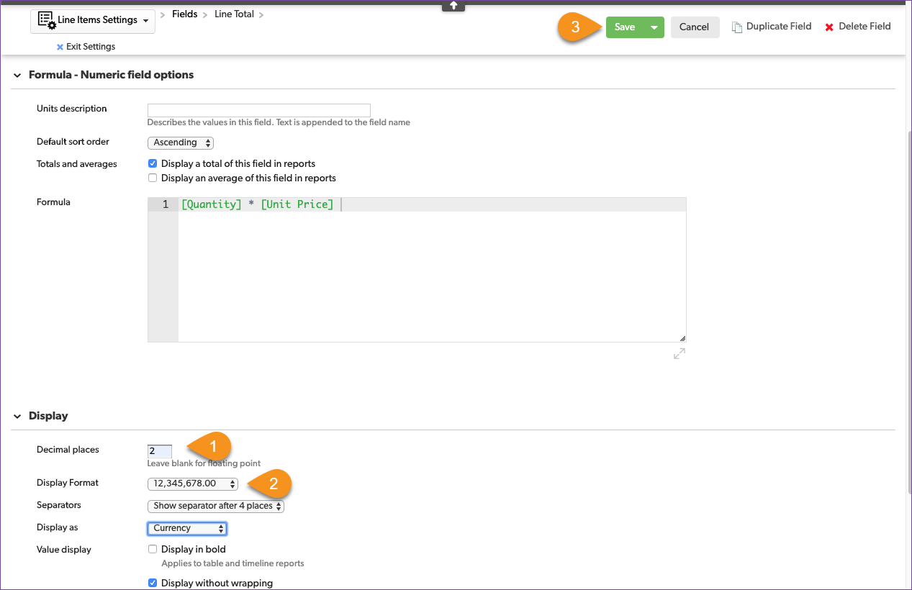
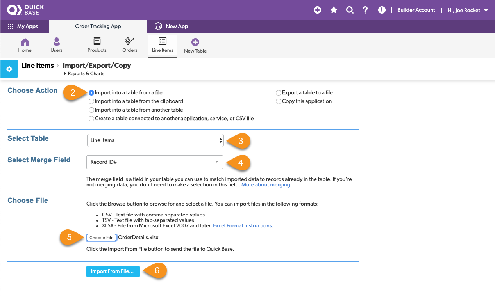

# Understanding Related Data

Drew kept track of items for each order in the `OrderDetails.xlsx` spreadsheet. Let's open it up and take a look.

| Column | Meaning | Type |
|:-|:-|:-|
| Order # | The order number from the Orders spreadsheet | text |
| Line # |  The line item in the order | number |
| Product # | The product number from the Products spreadsheet | text |
| Product Name | The product name from the Products spreadsheet | text |
| Unity Price | The Unit Price from the Products spreadsheet | currency |
| Quantity | The quantity of items for this order | number |

This time, as you review the spreadsheet, you recognize field names that are shared with the other spreadsheets. This is the information that Drew copied and pasted from spreadsheet to spreadsheet. By defining table relationships in Quick Base, it can automatically get the related information from one table and display it on another. Quick Base calls this a **table to table** relationship. Let's do that now. 

## Create the Line Items Table

The steps to create the `LineItems` table are a little different from what we did with the `Products` and `Orders` tables. Some fields in the `LineItems` table will have relationships with information stored in either the `Products` or `Orders` table so we don't have to import that data from the spreadsheet.

Only create fields to hold the data that isn't in the other tables. If the data is in the other tables, we will use lookups to pull it into this table. Start by creating the table:

1. Select **New Table**  
2. Select **From scratch - Design your own table**
3. Name the table: _Line Items_
4. Set A single record is called a: _Line Item_
5. Select an icon to represent your table
6. Provide a description 
7. Select **Create**

When the **Add New Fields** dialogue opens, add any field that is a **key** field in another table or is unique to the line item:

| Column | Meaning | Type |
|:-|:-|:-|
| Order # | The order number from the Orders spreadsheet | text |
| Line # |  The line item in the order | number |
| Product # | The product number from the Products spreadsheet | text |
| Quantity | The quantity of items for this order | number |

This time we accept the default `Record ID#` as the **key** field for the Line Items table.

## Relate the Line Items and Products Tables

Each line item in the line items table is related to a product in the products table using the `Product #` field. To avoid typing errors, Quick Base will use this relationship to look up the valid `Product #` and put them into a drop down list. Choosing an entry from a list is always easier then typing it in by hand. To make this work, connect the Line Items table to the Products table using a table-to-table relationship.

    1. Select **Table-to-table relationships** in the Table Structure group
    2. Select the blue **New Relationship** button  
    3. Set Line Items connects to to Products
    4. Select the option that indicates Products may have many Line Items
    5. Verify that the sentence _Each Product has many Line Items_ appears
    6. Select **Next**
    7. Set the line items reference field to Product #
    8. Select **Next**
    6. Set Lookup 1 to Products-Product Name
    7. Set Lookup 2 to Products-Unit Price
    8. Select the **Create Relationship** button

Select the `Product #` as the reference field.

Identify the related fields. 

> **Congratulations!** You just created your first table-to-table relationship! 

## Relate the Line Items and Orders Tables

Create a table-to-table relationship between the Line Items table and the Orders table.

~~~
    1. Select Table-to-table relationships in the Table Structure group
    2. Select the blue **New Relationship** button  
    3. Set Line Items connects to to Orders
    4. Select the option that indicates Orders may have many Line Items
    5. Verify that the sentence _Each Order has many Line Items_ appears
    6. Select **Next**
    7. Set the line items reference field to Order #
    8. Select **Next**
    9. Set Lookup 1 to Orders - Order Date
    10. Set Lookup 2 to Orders - Customer Name
    11. Select the **Create Relationship** button
~~~

Create a relationship with the `Orders` table.

Select `Order #` as the reference field.

Identify the related fields.

> **Congratulations** you have related the line items table to the Products and Orders table.

## Rename Fields

Select `Fields` from the Table Structure group and let's take a look at what happened in when we created those relationships. 

Notice ... 

Let's clean up some of those field names so that they aren't so long. Here is the process for updating the fields.

~~~
    1. Select the field name that you want to change
    2. Change the Label the name listed below
    3. Select the green **Save** button
~~~

|From|To|
|:---|:-|
|Product # - Product Name | Product Name|
|Product # - Unit Price|Unit Price|
|Order # - Order Date|Date|
|Order # - Customer Name|Customer Name|

Oh, and since we are here, we should sum up the total for each line in the order. Quick Base uses a formula field to store the sum of two fields from the same record.  

~~~
    1. Select **New Field** from the app nav bar
    2. Field Label: _Line Total_
    3. Type: _Formula - Numeric_
    4. Select **Add**
~~~

Notice that the Line Total field was addedd to the table configuration. Select `Line Total` to define the formula. 

1. Click in the formula editor box ~ the **Choose fields & functions** drop down appears
2. Select Quantity from the drop down
3. Type a * next to [Quantity] in the editor
4. Select **Product # - Unit Price** from the drop down
5. Verify that the formula is: _[Quantity]*[Product # - Unit Price]_

> **Congratulations!** You just created your first formula field! 

Remember that the formula field type is set to numeric, but we are storing currency in the field. We want the field to display as currency. So we will set how the field is displayed in reports. Scroll down until you see the **Display** section appear in your browser window. 

Configure the following:

1. Change **Decimal places** to 2
2. Change the  **Display as** to Currency
3. Click the green **Save** button in the navigation bar

## Import the Line Items Data

You’ve created the line items table and connected it to both the Products table and the Orders table. We even added a column to hold the total for each line item. Now its time to populate this table with the data from Drew’s spreadsheet. Then you can say goodbye to those spreadsheets!

1. Select the **Import/Export** button
2. Select **Import into a table from a file**
3. Confirm **Select Table** is set to Line Items, and **Select Merge Field** is set to Record ID.
4. Choose the OrderDetails.xlsx file

Remember, we aren't importing all of the data this time, so make sure that you carefully select what to do with each column. 

1. Configure the import as shown above
2. Select the **Import** button

The resulting page indicates the number of records and fields created.

## Verify the Import

Congrats! Your app now contains all the data from Drew’s spreadsheets. Click the `Line Items` table in the table nav and review that everything looks correct.

Verify the following:

* There are no blank fields in the records
* The product # CA8018 displays the correct product name
* The Line Total column is calculating correctly

[Next](report.html){: .btn .btn-purple }