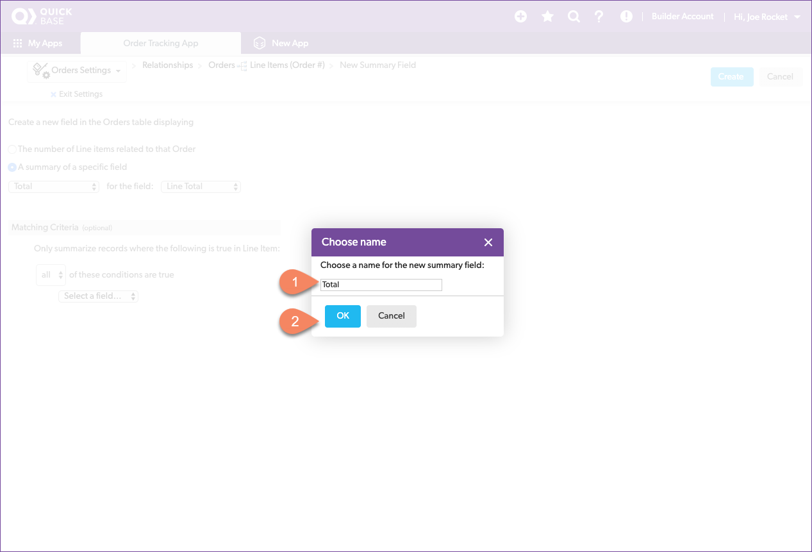
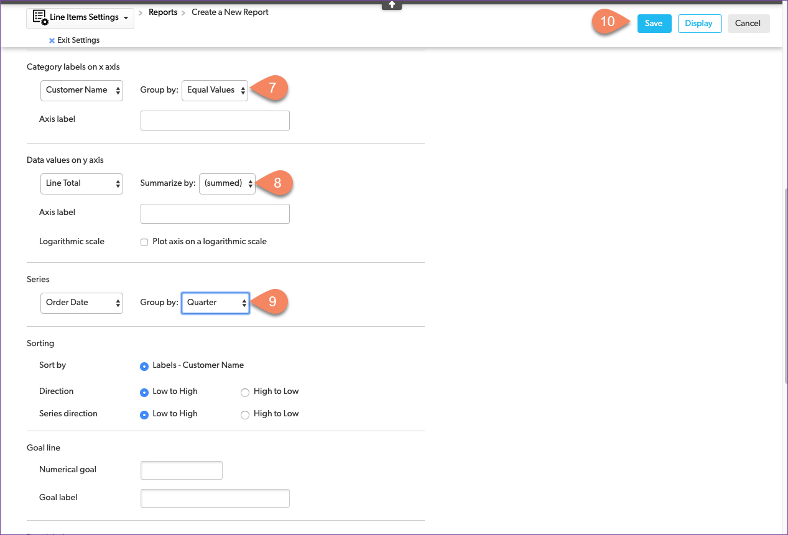
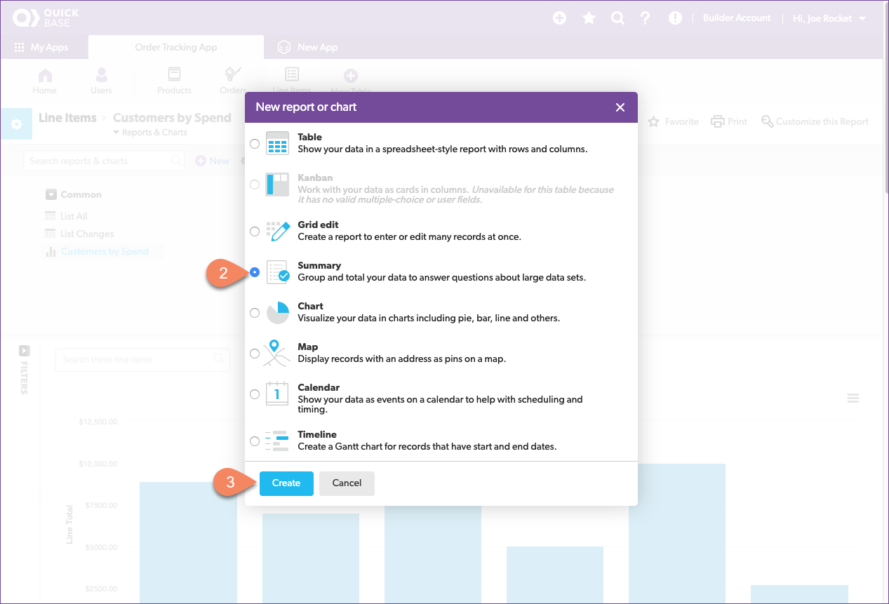

# Quick Base Reports

Remember the reports that management asked for in the morning meeting? They want to know which customers spend the most and which products produce the most revenue. We need to create a report to answer each question. Then, we can place them together on the app home page - the dashboard - so management can access them at any time.

Reports are visual displays of data. Quick Base can create pie charts, bar charts, line graphs, summary reports, and even calendars and maps. You’ve already seen the most common report Quick Base automatically creates, the table report. Each time you select a table icon in table navigation, Quick Base opens the table home page which displays the default report.

## Create a Table Report to Summarize Orders

Let's create a report to collect all the information from our table and display a summary of all the orders. Management didn't ask for this report, yet, but you know that it will help everyone understand what is going on and answer questions they have asked in the past. As you think about what everyone talks about in the morning meeting, you write down the fields that the team usually has questions about.

| Field | Source Table | Type |
|:-|:-|:-|
| Order # | Orders | text |
| Order Date | Orders | date |
| Customer Name | Customers | text |
| Items Ordered | Line Items | **link** |
| Order Total | **Formula** | currency | 

As you thought about the list of items in an order, you decided that a **link** to the `line items` for each order works best. You also decide that you want to include the total for the entire order in the summary, you know that you have to write a formula to do that so you write down **formula** as the source. 

### Add a Total Column

Select the **Orders** table icon in the table nav bar and the `Orders Home` page opens. You compare the fields in the default table report to the fields you wrote down for your report. They are close but not the same. Specifically, you notice that there is no order total for each order record. Let's add one. 

There are several ways to create a total field in Quick Base. You could define a formula like the one we used to calculate cost in the Line Items table, but there is an easier way. Because we created a table-to-table relationship between the Orders and Line Items tables, the relationship itself includes a [summary field](https://help.quickbase.com/user-assistance/create_summary_field.html) feature by default. Let's use that. 

Start by opening the relationship.

1. Click the **Orders** table in navigation 
2. Click the Gear icon to open table settings
3. Click **Table-to-table relationships** in the Table Structure group
4. Click the **Orders -> Line Items** relationship

Add a summary field.

1. Click **Add Summary Field**
2. The summary field configuration opens

1. Select **A summary of a specific field**
2. Select **Total** for the field
3. Select **Line Total** from the field list
4. Click the blue **Create** button

Name the field.

1. Name the field: _Total_
2. Click the blue **OK** button

The relationship between the Orders table and the Line Items table looks like this now:

Click the blue **Done** button to add the field to the table configuration. Then click on **Fields** in the **Table Structure** group and verify that the Total field was added to the table.

Exit the Order table settings. 

### Create a Custom Table Report

You're getting the hang of this! Now create a new report and configure it to display our summary field. Start by clicking on the **Orders** table in navigation to open the **Orders Home** page and expand the Reports & Charts list by clicking on **Reports & Charts**.

Create a new report by clicking on the **New** button next to the reports & charts search box.

1. Select Table in the New report pop-up
2. Name: _Orders Summary_
3. Description: _Summary of customer orders_
4. Select Custom columns
5. Select the Report Columns
6. Select **Sort or group on other fields** in the Sourting & Grouping group
7. Select **sort from hight to low by**
8. Select **Order Date** from the list of fields
9. Click the blue **Save** button

> **Congratulations!** You configured your first custom report in Quick Base!

Now, verify that the Orders Summary report is correct.

## Create a Bar Chart to View Customer by Spend

Management is interested in knowing which customers spend the most. We have fairly small customers but they purchase a lot from us. Let's use a bar chart to visualize the total that each customer has spent with us. This way, as customer orders are placed, management can see who is buying most and have a feel for how other customers compare. 

1. Click **New**
2. Select **Chart** on the New report pop-up
3. Name: _Customers by Spend_
4. Description: _Quarterly spend by each customer_
5. Select **bar** as the chart Type in the Chart Details group
6. Select **Customer Name** and **Equal Values** for the x axis
7. Select **Line Total** and **(summed)** for the y axis
8. Select **Order Date** and Group by: **Quarter** for the Series
9. Click the blue **Save** button
  

> You know, it's **celebration** time! Congrats on creating your first data visualization!

Verify that the bar chart correctly displays how much each customer has spent this quarter.

## Create a Summary Report to Display Products by Revenue

On to the next chart for management. This time we are looking to summarize the overall revenue generated by each product. Quick Base has a built in report type for this called a "Summary Report." Let's give that a try and see if it is what management is looking for. 

1. Click **New**
2. Select **Summary** from the New Report pop-up
3. Name: _Products by Revenue_
4. Description: _Products sorted by revenue_
5. Summarize: **Line Total**
6. Summarize By: **Totals**
7. Display As: **Normal Value**
8. Group By: **Product Name**
9. Combine: **Equal Values**
10. Sorty by: **Line Total (tot)**
11. Select **from hight to low**
12. Click the blue **Save** button

Yup, that is exactly what they asked for. But, before we put it in the dashboard, it's a good practice to verify that the summary chart correctly displays how much revenue each product has brought in.

It does! On to making a management dashboard that any can look at at any time. 

[Next](dashboard.html){: .btn .btn-purple }