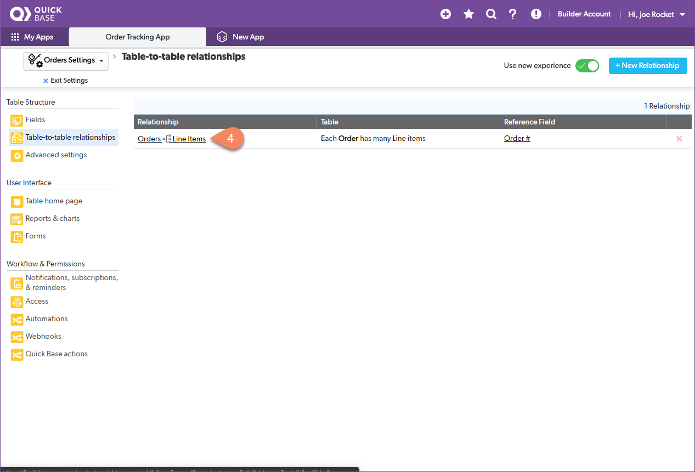
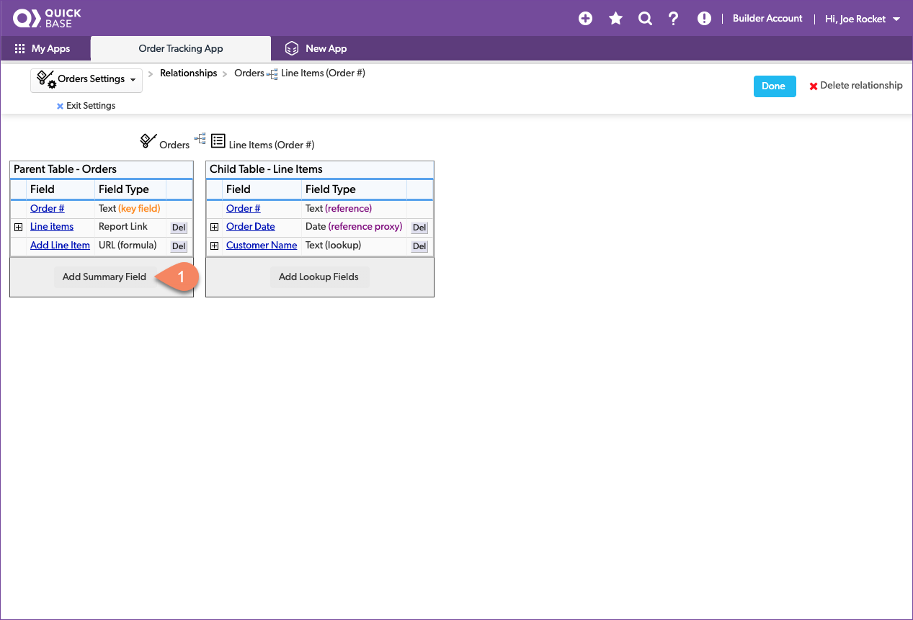
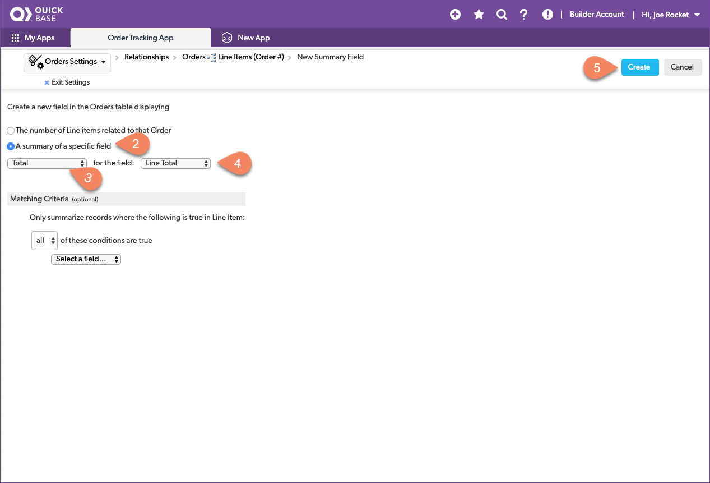
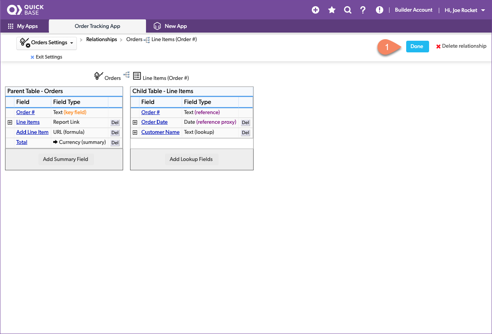
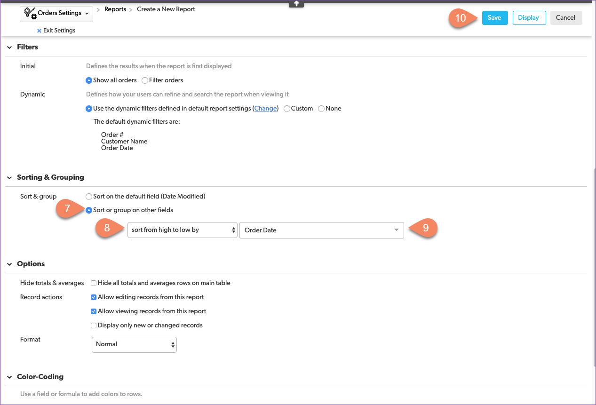
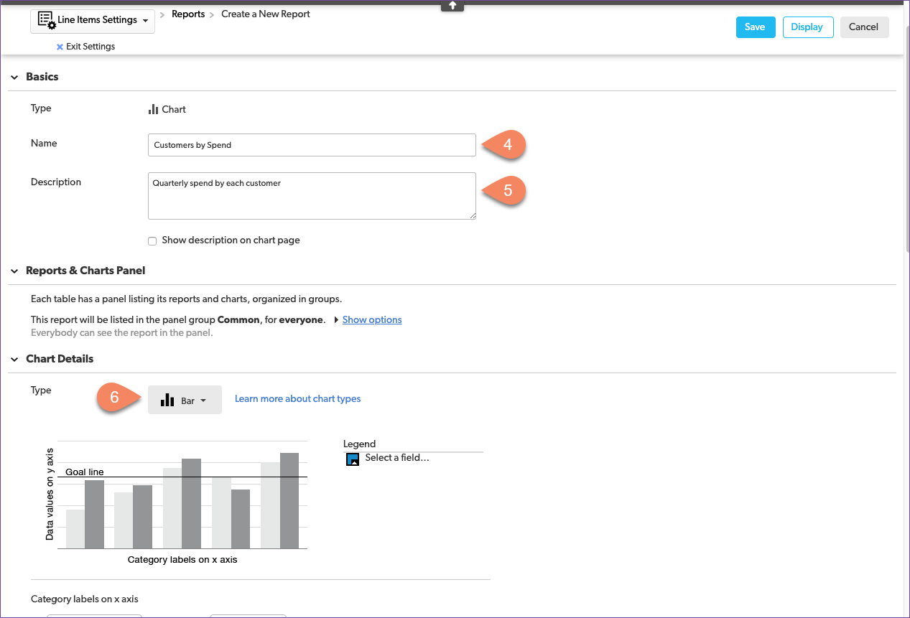
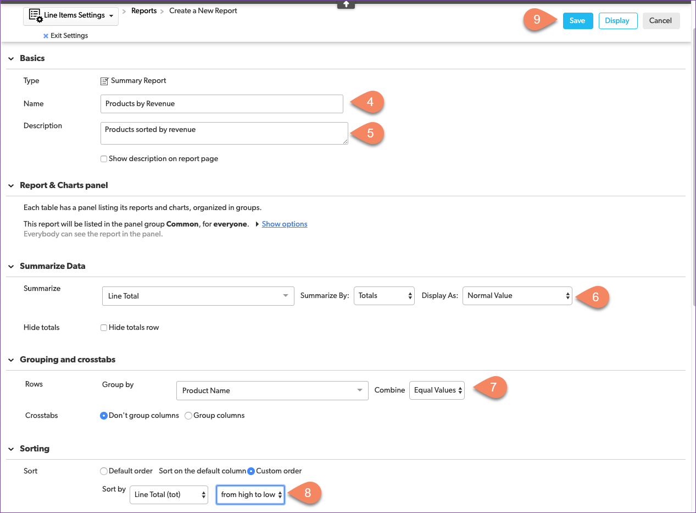

# Quick Base reports

Remember the reports that management asked for in the morning meeting? They want to know which customers spend the most and which products produce the most revenue. We need to create a report to answer each question. Then, we can place them together on the app home page — the dashboard — so management can access them at any time.

Reports are visual displays of data. Quick Base can create pie charts, bar charts, line graphs, summary reports, and even calendars and maps. You’ve already seen the most common report Quick Base automatically creates: the table report. Each time you select a table icon in table navigation, Quick Base opens the table home page, which displays the default report.

## Create a table report to summarize orders

Let's create a report to collect all the information from our table and display a summary of all the orders. Although management hasn't yet asked for this report, you know it'll help everyone understand what's going on and answer questions they've asked in the past. As you think about what everyone talks about in the morning meeting, you write down the fields that the team usually has questions about.

| Field | Source Table | Type |
|:-|:-|:-|
| Order # | Orders | text |
| Order Date | Orders | date |
| Customer Name | Customers | text |
| Items Ordered | Line Items | **link** |
| Order Total | **Formula** | currency | 

As you're thinking about the list of items in an order, you decide that a **link** to the `line items` for each order works best. Since you also decide that you want to include the total for the entire order in the summary, which requires a formula, you write down **formula** as the source.

### Add a total column

Select the **Orders** table icon in the table nav bar to open the `Orders Home` page. You compare the fields in the default table report to the fields you wrote down for your report. They're close but not the same. Specifically, you notice that there's no order total for each order record. So let's add one. 

There are several ways to create a total field in Quick Base. You could define a formula like the one we used to calculate cost in the Line Items table, but there's an easier way. Because we created a table-to-table relationship between the Orders and Line Items tables, the relationship itself includes a [summary field](https://help.quickbase.com/user-assistance/create_summary_field.html) feature by default. Let's use that. 

Start by opening the relationship.

1. Click the **Orders** table in navigation 
2. Click the gear icon to open table settings
3. Click **Table-to-table relationships** in the Table Structure group
4. Click the **Orders -> Line Items** relationship

Now add a summary field.

1. Click **Add Summary Field** to open the summary field configuration.
2. Select **A summary of a specific field**
3. Select **Total** for the field
4. Select **Line Total** from the field list
5. Click the blue **Create** button

Name the field.

1. Name the field _Total_
2. Click the blue **OK** button

Verify the relationship between the Orders table and the Line Items table.

1. Click the blue **Done** button to add the field to the table configuration
2. Click **Fields** in the **Table Structure** group
3. Verify the Total field was added to the table
4. Click **Exit Settings** 

### Create a custom table report

You're getting the hang of this! Now create a new report. 

1. Open the Orders Home page by clicking the **Orders** table in the table nav bar
2. Expand the Reports & Charts panel by clicking  **Reports & Charts**
3. Create a new report by clicking  **New** 

Now configure the table report to display the summary field. 

1. Select Table in the New report pop-up
2. Click **Create**
3. Name: _Orders Summary_
4. Description: _Summary of customer orders_
5. Select Custom columns
6. Select Report Columns
7. Select **Sort or group on other fields** in the Sorting & Grouping group
8. Select **sort from hight to low by** to have the most recent orders on top
9. Select **Order Date** from the list of fields
10. Click the blue **Save** button

> **Congratulations!** You configured your first custom report in Quick Base!

Now, verify that the Orders Summary report is correct.

## Create a bar chart to view customer by spend

Management wants to know which customers spend the most. We have fairly small customers, but they buy a lot. Let's use a bar chart to visualize the total that each customer has spent with us. This way, as customer orders are placed, management can see who's buying most and have a feel for how other customers compare.

1. Click **New**
2. Select **Chart** on the New report pop-up
3. Click **Create**
4. Name: _Customers by Spend_
5. Description: _Quarterly spend by each customer_
6. Select **bar** as the chart type in the Chart Details group
7. Select **Customer Name** and **Equal Values** for the x-axis
8. Select **Line Total** and **(summed)** for the y-axis
9. Select **Order Date** and Group by: **Quarter** for the Series
10. Click the blue **Save** button

  
> It's **celebration** time! Congrats on creating your first data visualization!

Verify that the bar chart correctly displays how much each customer has spent this quarter.

## Create a summary report to display products by revenue

On to the next chart for management. This time we're looking to summarize the overall revenue generated by each product. Quick Base has a built-in report type for this called a "Summary Report." Let's give that a try and see if it works for management.

1. Click **New**
2. Click **Create**
3. Select **Summary** from the New Report pop-up
4. Name: _Products by Revenue_
5. Description: _Products sorted by revenue_
6. Set Summarize Data to: Summarize: **Line Total**, Summarize By: **Totals**, and Display As: **Normal Value**
7. Set grouping to: Group By: **Product Name** and Combine: **Equal Values**
8. Set sorting to; Sort by: **Line Total (tot)** and **from hight to low**
9. Click the blue **Save** button

Yes, management is going to be pleased. That's exactly what they asked for. But, before we put it in the dashboard, it's a good practice to verify that the summary chart correctly displays how much revenue each product has brought in.

It does! Our next task is to make a management dashboard that anyone can view at any time. 

[Next](dashboard.html){: .btn .btn-purple }
